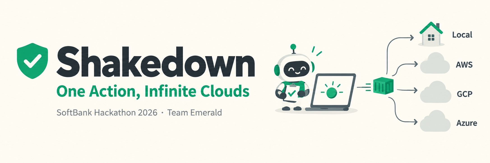

# Shakedown

레포 링크 하나로 같은 이미지를 Local과 클라우드(AWS · GCP · Azure)에 배포하고, 두 곳이 똑같이 동작하는지 AI 시운전으로 확인해서 다르면 클라우드 공개를 막는 배포 서비스입니다.

SoftBank Hackathon 2026 Term2 · Team Emerald

<!-- 이 README는 프로젝트 소개용이다. 실행 방법과 API는 하단 "개발 문서"의 모듈별 README를 본다. -->

## 1. 프로젝트 개요

### 1-1. 프로젝트 소개

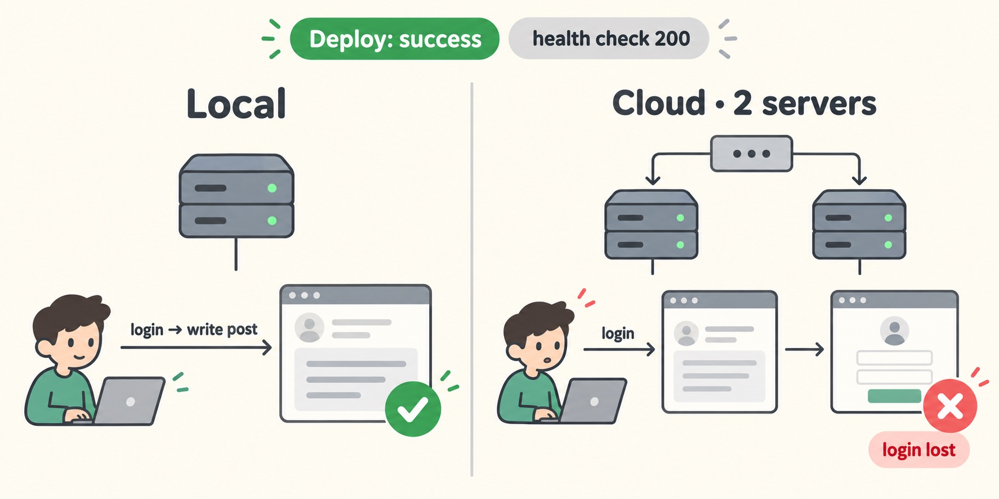

배포가 성공했다고 떠도 막상 써 보면 클라우드에서만 로그인이 풀리거나 글이 안 써지는 일이 있습니다. 헬스 체크는 통과하니 사람이 직접 눌러 보기 전까지는 모릅니다. Local은 서버가 1대라 괜찮지만, 클라우드에서 서버가 2대가 되면 세션을 서버 메모리에 두는 앱은 다음 요청이 다른 서버로 가면서 로그인이 풀립니다.

Shakedown은 이 차이를 배포 단계에서 잡습니다. 같은 컨테이너 이미지를 Local과 클라우드에 올리고, 두 주소에서 가입부터 댓글까지 같은 사용자 흐름 8단계를 돌려 비교합니다. 다르게 움직이면 클라우드 공개를 막고, 원인과 고치는 방법을 보고서로 보여 줍니다.

### 1-2. 동작 흐름

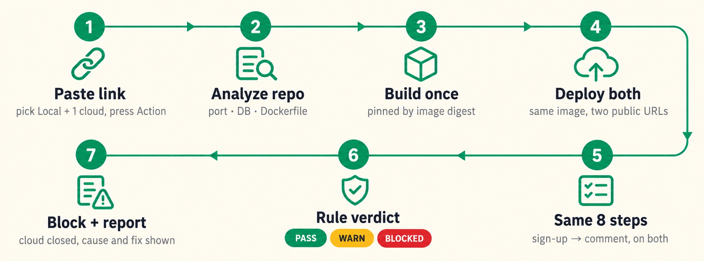

1. 레포 링크를 넣고 Local과 클라우드 하나를 고른 뒤 Action을 누릅니다.
2. 엔진이 레포를 읽어 포트, DB, Dockerfile 같은 배포 설정을 채웁니다.
3. 이미지는 한 번만 빌드하고 digest(이미지 내용으로 만든 고유 번호)로 고정합니다. 두 환경이 정말 같은 이미지를 돌리게 하려는 장치입니다.
4. 같은 이미지가 Local과 클라우드에 올라가고 각각 공개 주소가 생깁니다.
5. 시운전이 두 주소에서 같은 8단계를 실행합니다.
6. 규칙이 PASS · WARN · BLOCKED 중 하나로 판정합니다.
7. BLOCKED면 클라우드 공개를 막고 원인 보고서와 수정 제안을 띄웁니다.

### 1-3. 시스템 구성도

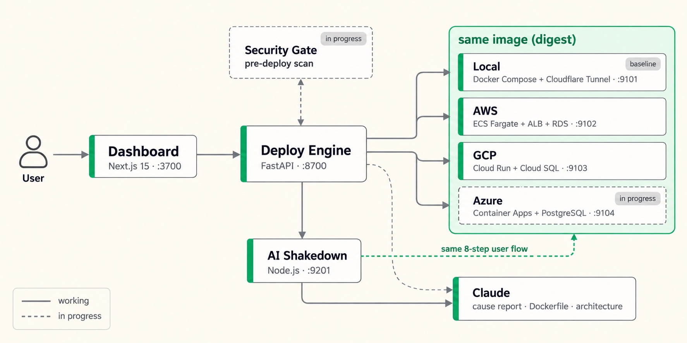

대시보드가 엔진을 부르고, 엔진이 환경마다 있는 배포 API(어댑터)를 불러 배포합니다. 시운전은 배포가 끝난 공개 주소 두 개를 받아 비교합니다. 모듈끼리는 [OpenAPI 계약](packages/contracts/README.md)을 먼저 정해 두고 각자 따로 만들었습니다. 점선은 아직 연결 중인 부분입니다.

전체 아키텍처 다이어그램(KR · EN · JP)은 [아키텍처 페이지](https://softbankhackathon.github.io/shakedown/architecture/)에서 볼 수 있습니다.

### 1-4. 환경 차이를 흡수하는 방법

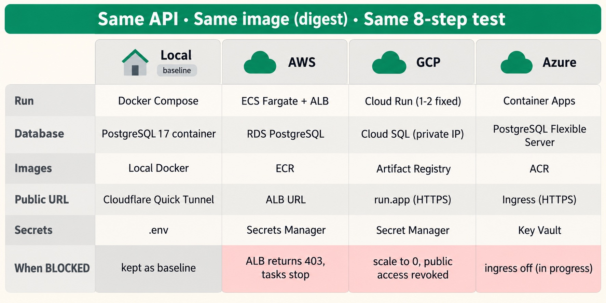

엔진은 환경마다 다른 부분을 각 배포 API 안에 가둡니다. 바깥에서 보면 네 환경 모두 같은 API(`target.yaml`), 같은 이미지(digest), 같은 시나리오로 움직이고, 안쪽에서는 각 클라우드의 기능을 그대로 씁니다. 예를 들어 BLOCKED가 나면 AWS는 ALB가 403을 돌려주고, GCP는 Cloud Run을 0대로 내린 뒤 공개 권한을 회수합니다.

### 1-5. 구성 요소와 기술 스택

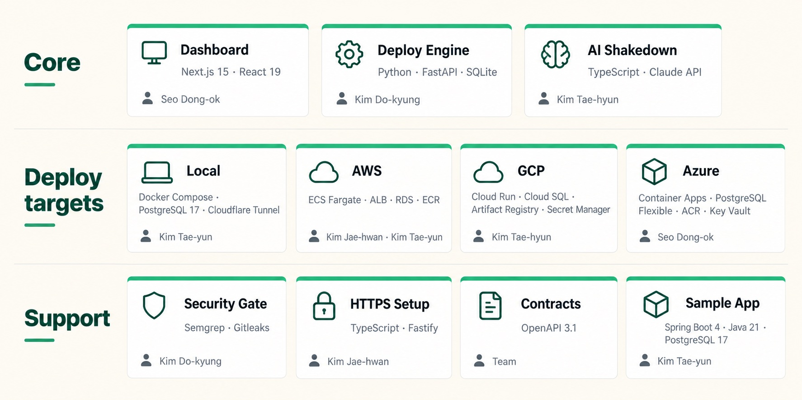

- **대시보드** — Next.js 15 · React 19 · TypeScript. 화면 언어는 KR · EN · JP
- **배포 엔진** — Python · FastAPI · SQLite
- **AI 시운전** — TypeScript(Node.js, 빌드 없이 실행) · Claude API
- **배포 대상** — Local(Docker Compose · Cloudflare Quick Tunnel) · AWS(ECS Fargate · ALB · RDS · ECR) · GCP(Cloud Run · Cloud SQL · Artifact Registry · Secret Manager) · Azure(Container Apps · PostgreSQL Flexible Server · ACR · Key Vault)
- **배포 전 보안 검사** — Docker Compose 위험 설정 · Semgrep · Gitleaks
- **공통 계약** — OpenAPI 3.1 (engine · target · shakedown)
- **샘플 앱** — Spring Boot 4 · Java 21 · PostgreSQL 17

## 2. 개발 결과물

### 2-1. 데모 시나리오

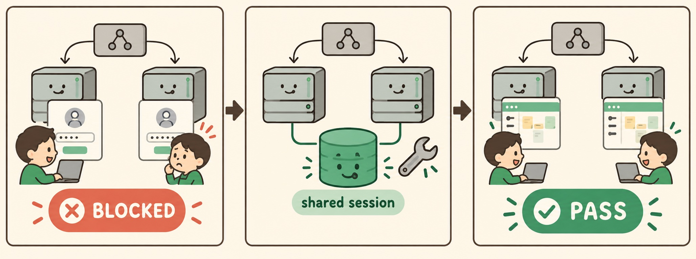

시연용 게시판 앱은 세션을 서버 메모리에 두는 설정(session-memory)과 DB에 두는 설정(session-jdbc)을 한 이미지에 담고 있습니다. 클라우드에 서버 2대 + 메모리 세션으로 배포하면 클라우드에서만 로그인이 풀려 BLOCKED가 나고, 보고서가 원인으로 "서버 2대 + 메모리 세션"을 짚습니다. 환경변수 하나를 DB 공유 세션으로 바꿔 다시 배포하면 PASS가 납니다. 수정 적용 버튼은 [PR #18](https://github.com/SoftBankHackathon/shakedown/pull/18)에서 리뷰 중입니다.

### 2-2. AI를 쓰는 곳과 쓰지 않는 곳

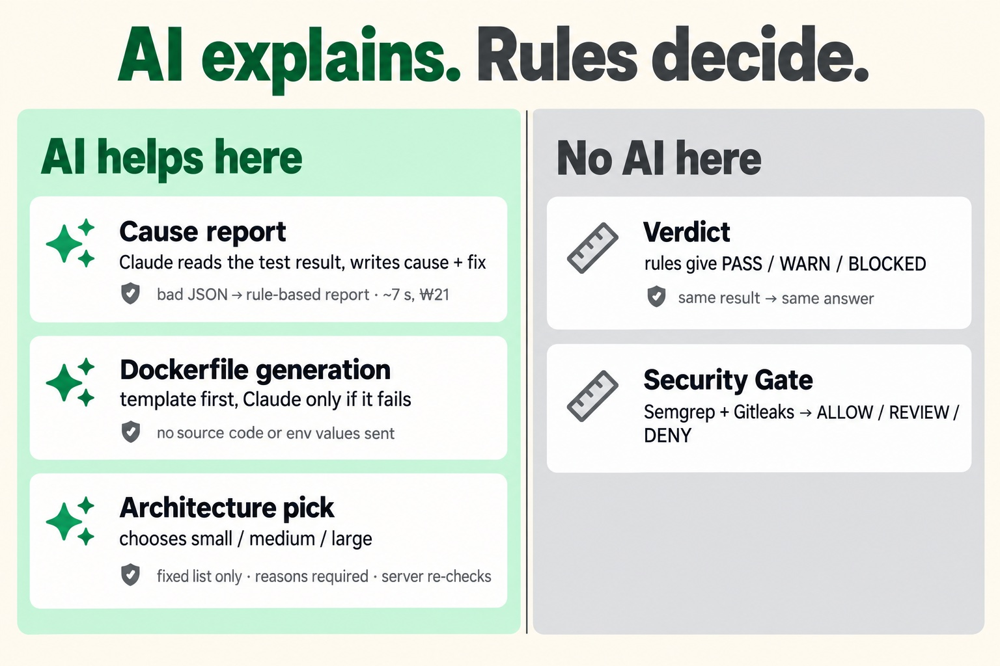

AI는 판단을 돕는 자리에만 두고, 결과를 뒤집는 자리에는 두지 않았습니다. 판정은 규칙이 하므로 같은 결과에는 항상 같은 답이 나옵니다. AI 응답이 정해진 JSON 형식이 아니면 버리고 규칙 보고서를 쓰기 때문에, AI가 실패해도 판정과 배포는 바뀌지 않습니다.

### 2-3. 검증 결과

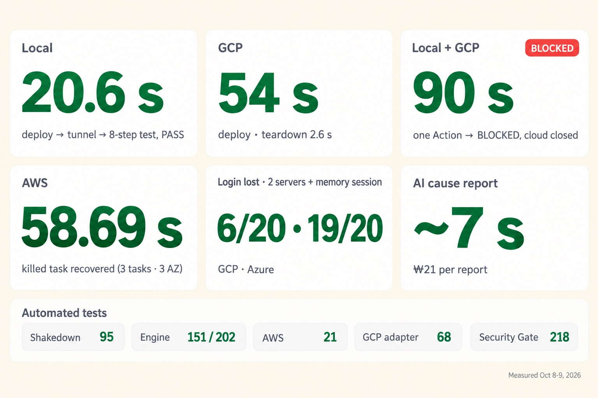

적어 둔 수치는 모두 실제로 돌려 본 결과입니다. 대시보드에서 Local + GCP를 한 번에 배포하면 90초 만에 판정까지 끝납니다. 서버 2대 + 메모리 세션에서 GCP는 20번 중 6번, Azure는 19번 로그인이 풀려서 두 클라우드 모두에서 차단 장면을 재현할 수 있었습니다. 수치마다 출처 PR은 [설계 문서](https://app.notion.com/p/1b28bee9ada4820d8ce681ad430490b7)에 달아 두었습니다.

### 2-4. 설계 결정

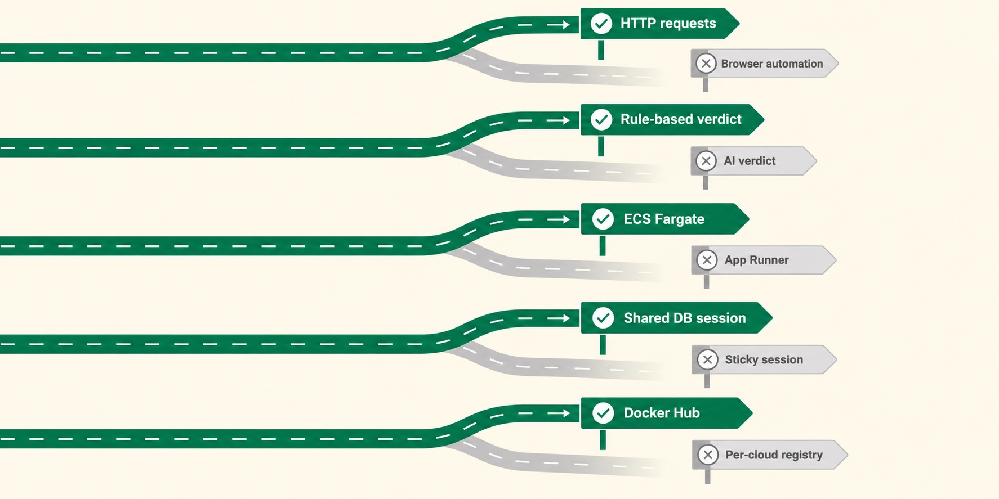

고를 때마다 다른 안을 같이 놓고 비교했습니다. 시운전은 브라우저 자동화 대신 HTTP 요청 8단계로, 판정은 AI 대신 규칙으로, AWS 실행은 App Runner 대신 ECS Fargate로, 로그인 풀림은 세션 고정 대신 DB 공유 세션으로 정했습니다. 이미지 저장소는 클라우드별 저장소 대신 Docker Hub로 통일하기로 했고 지금 옮기는 중입니다. 12개 결정의 이유는 [설계 문서](https://app.notion.com/p/1b28bee9ada4820d8ce681ad430490b7)의 "왜 이걸 골랐나"에 있습니다.

## 3. 수행 방법

### 3-1. 설계 변경 이력

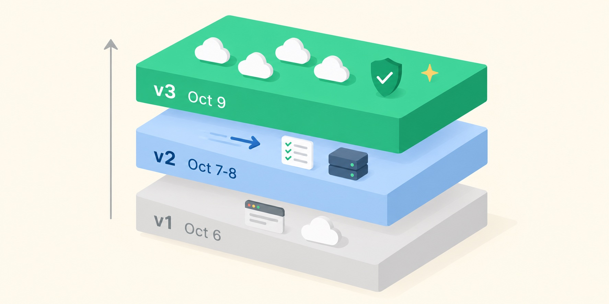

설계는 사흘 동안 세 번 크게 바뀌었습니다.

- **v1 · 10/6** — Local과 GCP Cloud Run에 동시에 배포하고, AI 브라우저 에이전트가 화면을 보며 시나리오를 짜는 구상
- **v2 · 10/7 ~ 10/8** — 대상을 Local + AWS로 좁히고, 시운전은 HTTP 8단계, 판정은 규칙, AI는 원인 보고서만
- **v3 · 10/9** — AWS ECS 구조를 기준으로 GCP · Azure를 같은 모양으로 붙이고, Dockerfile 자동 생성 · 클라우드 구성 추천 · 배포 전 보안 검사를 더함

### 3-2. 진행 방식

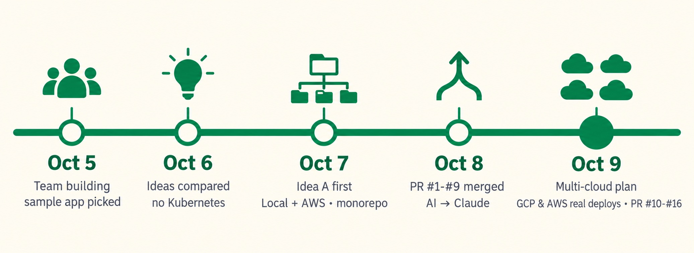

매일 밤 온라인으로 모였고, 회의록은 Notion에, 그날 한 일은 Slack 스크럼 스레드에 완료 · 진행중 · 대기중으로 남겼습니다. 모듈 사이 약속(OpenAPI)을 먼저 정해 둔 덕분에 다섯 명이 각자 만들어도 PR로 바로 합칠 수 있었습니다. 작업은 기능 브랜치에서 main으로 PR을 올려 합칩니다.

## 4. 팀

<table>
  <tr>
    <td align="center" width="20%"><a href="https://github.com/SeoDongOk"> <b>서동옥</b></a> 총괄 · 대시보드 · Azure</td>
    <td align="center" width="20%"><a href="https://github.com/dogyeongkim03"> <b>김도경</b></a> 배포 엔진 · 보안 검사</td>
    <td align="center" width="20%"><a href="https://github.com/jaehwan-space"> <b>김재환</b></a> AWS · HTTPS</td>
    <td align="center" width="20%"><a href="https://github.com/xodbs1021"> <b>김태윤</b></a> Local · 통합 · 구성 추천</td>
    <td align="center" width="20%"><a href="https://github.com/kth4778"> <b>김태현</b></a> AI 시운전 · GCP</td>
  </tr>
</table>

| 이름 | 처음 맡은 일 (10/7) | 10/9 오프라인 회의 이후 |
|---|---|---|
| 서동옥 | 총괄, 대시보드, 공통 API 명세 | Azure 배포 |
| 김도경 | 배포 엔진, 레포 분석 | 배포 전 보안 검사(Security Gate) |
| 김재환 | AWS 배포 | AWS(ECS), HTTPS 자동 설정 |
| 김태윤 | Local 배포, 샘플 앱, 전체 통합 | Dockerfile 자동 생성, 클라우드 구성 추천 |
| 김태현 | AI 시운전 | GCP 배포, 설계 문서 |

---

## 개발 문서

- [배포 엔진 — 실행과 API](apps/engine/README.md)
- [AI 시운전 — HTTP 시운전과 원인 보고서](apps/shakedown/README.md)
- [배포 전 보안 검사](apps/security-gate/README.md)
- [Local 배포](infra/local/README.md) · [AWS 배포](infra/aws/README.md) — GCP · Azure 배포는 PR 리뷰 중 ([#13](https://github.com/SoftBankHackathon/shakedown/pull/13) ~ [#15](https://github.com/SoftBankHackathon/shakedown/pull/15), [#23](https://github.com/SoftBankHackathon/shakedown/pull/23))
- [공통 계약(OpenAPI)](packages/contracts/README.md)
- [샘플 앱](samples/README.md)
- [2026-10-08 통합 점검](docs/integration-audit-2026-10-08.md)
- [설계 문서 (Notion)](https://app.notion.com/p/1b28bee9ada4820d8ce681ad430490b7)
