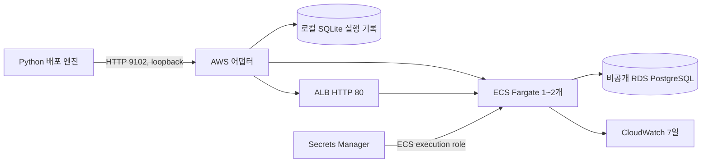

# AWS 배포 모듈 — ECS Fargate + ALB + RDS

김재환 담당 범위의 구현입니다. 한 프로젝트에 대한 AWS 배포·준비 상태 확인·로그 조회·공개 접근 차단을 제공합니다. App Runner 대신 ECS Fargate를 사용합니다. **실제 AWS 계정은 아직 정해지지 않았고, 클라우드 배포는 검증 전입니다.** API/SDK 경계 테스트와 실제 로컬 컨테이너 검증은 구분해서 기록합니다.

## 구성과 실행 순서



- 리전: 서울. Linux AMD64, 0.5 vCPU/1 GiB, 고정 replicas 1~2. 한 스택·어댑터 프로세스·상태 DB를 한 프로젝트에 연결합니다.
- 공개 ALB → 앱 SG 8080 → DB SG 5432. RDS는 인터넷 경로 없는 서브넷에 배치합니다.
- 앱은 public subnet/public IP로 ECR·로그에 접근합니다. 인터넷에서 앱 포트 직접 접근은 SG가 막습니다. NAT Gateway는 만들지 않습니다.
- 초기 스택 생성 및 DB 초기화는 배포 버튼과 분리합니다. 매 배포는 기존 ECS 서비스의 task definition만 교체합니다.
- 실제 API는 `packages/contracts/openapi/target.yaml`. 엔진의 AWS 호출·ECR 업로드·동일 digest 비교 흐름은 연결되어 있습니다. 설정 방법은 `apps/engine/README.md`의 AWS 연결을 참고하세요. **실제 AWS 계정 통합 검증은 아직 수행하지 않았습니다.**

## AWS 없이 검증

저장소 루트, Node 24:

```sh
npm ci --ignore-scripts
npm run check:aws
npm run test:aws
```

실제 세션 문제 재현에는 Docker가 필요합니다. 아래 테스트는 독립 PostgreSQL DB와 임시 컨테이너만 생성하고 종료 시 해당 자원만 삭제합니다. 기존 서비스/볼륨은 건드리지 않습니다.

```sh
docker build --platform linux/amd64 -t shakedown-board:aws-session-test samples/kty-board
python3 infra/aws/scripts/session-smoke.py
```

검증: 스키마 초기화 재실행, 서버 A 로그인→B 실패(memory), A 로그인→B 성공(jdbc), B에서 글 작성→A/B에서 조회, 앱 재시작 후 세션·게시글 보존. 결과는 `.data/session-smoke/latest.json`에 남깁니다. 이 결과는 AWS ALB/RDS 검증을 대신하지 않습니다.

## 계정이 정해진 뒤 실행할 절차

아래 단계는 비용이 발생하는 실제 AWS 작업입니다. 아직 실행하지 않았습니다. 기존 `default` 프로필을 자동으로 사용하지 않습니다.

1. 해커톤 전용 named profile과 12자리 계정 ID를 선택합니다. 프로비저닝 권한, 어댑터 역할, 이미지 업로드 역할을 구분합니다. 비밀키를 Git/Notion에 적지 않습니다.
2. 프로비저닝 담당 권한으로 CloudFormation을 실행합니다. RDS minor 버전과 db.t3.micro의 서울 리전 가용성을 먼저 조회합니다. 사용할 PostgreSQL 17 minor 버전을 `HACKATHON_POSTGRES_VERSION`에 반드시 지정하세요. 지원 여부는 스크립트가 계정·리전에서 확인합니다.

```sh
export HACKATHON_PROVISION_PROFILE=hackathon-provision
export HACKATHON_ACCOUNT_ID=YOUR_ACCOUNT_ID
export HACKATHON_STACK=shakedown-board
bash infra/aws/scripts/provision.sh
mkdir -p .data/aws
aws --profile "$HACKATHON_PROVISION_PROFILE" --region ap-northeast-2 cloudformation describe-stacks \
  --stack-name "$HACKATHON_STACK" --query 'Stacks[0].Outputs' --output json > .data/aws/outputs.json
node --import tsx infra/aws/scripts/config-from-outputs.ts .data/aws/outputs.json \
  hackathon-adapter "$HACKATHON_ACCOUNT_ID" prj_board > .data/aws/config.json
```

3. Outputs의 `AdapterPolicyArn`을 어댑터가 사용할 principal에, `ImagePublisherPolicyArn`을 엔진/이미지 빌드 principal에 부여합니다. postgres_url 지원을 위해 어댑터는 이 스택의 DB 비밀값을 읽고 전용 URL Secret만 갱신할 수 있습니다. `PassRole`은 이 스택의 실행·앱 역할만 허용합니다. 실행 역할만 ECR pull/로그/해당 DB secret을 사용할 수 있고 앱 task role에는 AWS 관리 권한이 없습니다. ECS 서비스 연결 역할은 첫 사용 때 생성할 수 있도록 범위를 제한했습니다.
4. 엔진이 이미지를 **한 번** 빌드·업로드하고 반환된 digest 주소를 Local/AWS 모두 사용합니다. 수동 준비용 보조 스크립트는 아래와 같습니다. multiarch/index manifest 대신 단일 AMD64 manifest를 사용합니다.

```sh
export HACKATHON_PUBLISH_PROFILE=hackathon-publisher
export HACKATHON_REPOSITORY=shakedown-board
export HACKATHON_IMAGE_TAG=UNIQUE_COMMIT_TAG
bash infra/aws/scripts/publish-image.sh
```

5. 같은 digest 이미지로 스키마 초기화 작업을 한 번 실행합니다. AWS에서는 schema-init으로 JPA DDL update와 버전에 맞는 Spring Session PostgreSQL SQL을 수행합니다. AWS 앱 서비스는 주입된 DDL validate 설정으로 실행되므로 여러 서버가 테이블을 동시에 만들지 않습니다. schema-init은 테이블을 비우지 않지만, 운영 마이그레이션 도구는 아닙니다. 실행 중인 앱이 없는 초기 준비 시점에 실행합니다.

```sh
npm run bootstrap -w @shakedown/aws -- ../../.data/aws/config.json 'ECR_URI@sha256:DIGEST'
```

6. 어댑터를 실행합니다. `AWS_ADAPTER_CONFIG`는 절대 경로 권장입니다. config는 계정/ARN을 포함하지만 비밀값은 포함하지 않습니다.

```sh
export AWS_ADAPTER_CONFIG="$PWD/.data/aws/config.json"
export AWS_ADAPTER_DB="$PWD/.data/aws/state.sqlite3"
npm run dev:aws
```

서버는 `127.0.0.1:9102`만 바인딩합니다. 프로세스 시작 시 STS 계정 검증과 중단된 배포 복구를 마친 후 포트를 엽니다. `.lock`이 남았으면 기록된 PID가 종료됐는지 확인한 후에만 삭제합니다. 동일 스택을 다른 DB/프로세스로 동시에 제어하지 않습니다.

## 엔진 연결 예시와 계약

`POST /deployments` → 202 → 2~3초마다 GET → `ready` 후 공개 URL로 시운전합니다.

```json
{
  "deployment_id": "dep_demo01",
  "project_id": "prj_board",
  "image": "123456789012.dkr.ecr.ap-northeast-2.amazonaws.com/shakedown-board@sha256:aaaaaaaaaaaaaaaaaaaaaaaaaaaaaaaaaaaaaaaaaaaaaaaaaaaaaaaaaaaaaaaa",
  "port": 8080,
  "health_path": "/",
  "env": { "SPRING_PROFILES_ACTIVE": "demo,session-memory" },
  "secret_refs": { "SPRING_DATASOURCE_PASSWORD": "db_password" },
  "database": { "engine": "postgres", "name": "board_db" },
  "options": { "replicas": 2, "sticky_sessions": false, "tz": "UTC" }
}
```

- DB URL/사용자/비밀번호는 스택 설정에서 ECS에 주입합니다. `secret_refs`는 `SPRING_DATASOURCE_PASSWORD: db_password`만 지원하며 생략해도 같은 관리형 설정을 사용합니다. 임의 env, plaintext secret, 다른 DB, sticky=true, replicas>2는 400입니다.
- 동일 ID+내용 재시도는 기존 결과, 다른 내용/삭제 ID/프로젝트 동시 변경은 409입니다. 새 배포에는 새 ID를 사용합니다.
- `ready`: 현재 revision과 digest가 일치하는 앱 task 수 확인 → 이전 task/target 제거 → ALB targets 모두 healthy → 공개 라우트 연결 → **쿠키 없이 health_path HTTP 200**. 리다이렉트는 성공으로 보지 않습니다.
- 준비 대기는 270초 제한. 실패 시 공개 차단과 앱 정리를 시도합니다. 정리 자체는 최대 120초 추가될 수 있으므로 엔진은 5분 타임아웃 뒤에도 로그 조회 및 DELETE를 수행해야 합니다. 정리 실패 시 새 배포를 잠그고 DELETE 재시도를 받습니다.
- `info`: runtime, session, timezone, sticky_sessions, task_definition, image_digest. task 수/digest는 ECS task에서, 세션/TZ는 등록된 task definition에서 읽습니다. DB 엔진 표기는 이 스택의 설정 정보입니다.
- GET 로그는 timestamp/source/line 배열. 앱 로그는 배포 ID별 CloudWatch stream들의 최근 50개를 합칩니다. 배포 로그와 합쳐 최대 200개. `since`는 ISO 8601이며 비밀 필드를 가립니다. SDK 호출을 사용하므로 실행하지 않은 CLI 명령을 `commands`에 넣지 않습니다.

### BLOCKED 판정과 실제 차단

엔진은 판정 후 **증거 및 최근 로그 수집 → DELETE → 차단 확인 → AI 보고서** 순서로 연결합니다. AI 보고서 실패가 공개 라우트를 다시 열면 안 됩니다.

- 최신 배포 DELETE: ALB 고정 403 설정 및 HTTP 403 확인 → ECS 서비스 desired=0/삭제 → 중지 확인 후 204.
- 이전 배포 DELETE: 과거 기록만 삭제 표시, 현재 서비스는 유지.
- 삭제된 GET은 404, 동일 ID 재사용은 409. 로그는 계속 조회할 수 있습니다. RDS/CloudWatch는 남습니다.
- 삭제 도중 오류는 502이며 DELETE를 재시도할 수 있습니다. 실패했는데 204를 보내지 않습니다.
- 새 배포 준비 중에는 403을 유지합니다. 정상 운영 버전을 따로 유지하는 Blue/Green/자동 롤백은 이번 구현 범위에 없습니다.
- 과거 GET 결과는 해당 배포 완료 당시의 기록입니다. URL이 지금도 그 버전을 제공한다는 의미는 아닙니다. 엔진은 최신 배포 ID를 표시해야 합니다.

## 시연과 남은 통합

1. 동일 image digest + PostgreSQL로 Local 1대 / AWS 2대를 시작합니다. AWS profile은 `demo,session-memory`, stickiness=false.
2. 시운전이 로그인→글쓰기의 `302 /` 차이와 `X-Instance-Id` 변경을 수집해야 합니다. ALB round-robin이 항상 A/B 교대를 보장하지 않으므로 인스턴스가 실제 바뀌었는지 증거로 확인합니다. 전환이 없으면 재시도/미검증 처리하며 통과로 꾸미지 않습니다.
3. 문제는 DB가 글을 삭제한 것이 아니라 **서버 간 로그인 세션이 공유되지 않아 글 저장 전에 로그인 화면으로 돌아간 상황**입니다. 실제 저장된 글의 영속성 검증은 별도 단계입니다.
4. BLOCKED 후 로그 수집/DELETE 403 확인. 새 ID와 `demo,session-jdbc`로 같은 이미지를 배포한 뒤 다시 검사합니다.
5. 앱 재배포 후 DB 글과 로그인 세션 유지, CLI/API 이벤트 시간, 공개 URL, 실제 task/target 수를 기록합니다.

엔진에 연결된 항목 (실제 계정 검증 필요): ECR push/digest 고정, 위 POST/GET/DELETE 호출, Local에도 같은 digest와 JVM/DB 호환 설정 전달, BLOCKED 시 로그→DELETE 순서. 샘플 담당자와 연결할 항목: Dockerfile/프로필/헤더 및 schema-init. Local과 AWS 모두 PostgreSQL을 사용하며 schema-init은 PostgreSQL 세션 테이블을 초기화합니다. Local 배포 API도 초기화 작업을 수행합니다.

## 비용·정리·제한

ALB, Fargate, public IPv4, RDS, ECR, Secrets Manager, 로그 비용이 발생합니다. DELETE는 앱만 내려가며 ALB/RDS 비용은 계속됩니다. 데모 종료 후 인프라 담당자가 별도 스택 정리를 수행해야 합니다. DB는 스택 삭제 시 snapshot, ECR/로그/secret은 Retain이므로 남은 리소스와 snapshot 비용도 확인합니다. 앱을 먼저 DELETE해야 동적으로 만든 ECS 서비스가 스택 정리를 막지 않습니다.

HTTP 데모라 실제 사용자 개인정보/비밀번호는 사용하지 않습니다. 샘플의 기존 단순 인증 구조는 운영 서비스용으로 강화한 범위가 아닙니다. 이번 스키마 초기화는 같은 DB 계정을 사용하며, 운영 전환 시 애플리케이션 DML 계정과 마이그레이션 DDL 계정을 분리해야 합니다. 정식 서비스의 HTTPS/인증/역할별 DB 권한/버전 마이그레이션은 별도입니다.

참고: [ECS Fargate 네트워크](https://docs.aws.amazon.com/AmazonECS/latest/developerguide/fargate-task-networking.html), [Spring Session JDBC](https://docs.spring.io/spring-session/reference/configuration/jdbc.html), [RDS PostgreSQL 버전](https://docs.aws.amazon.com/AmazonRDS/latest/UserGuide/PostgreSQL.Concepts.VersionMgmt.html).

## 검증 기록 — 2026-10-08

- TypeScript strict 검사와 공통 계약 타입 검사 통과.
- 어댑터/API/SQLite 및 AWS SDK 경계 테스트 **15개 통과**. SDK 응답은 테스트 대역이며 실제 AWS 배포 성공을 의미하지 않습니다.
- 샘플 Gradle 테스트 **3개 통과**, bootJar 및 Linux AMD64 Docker 이미지 빌드 통과.
- 실제 PostgreSQL 17 + ARM64 앱 컨테이너 2개: memory 모드의 교차 서버 로그인 실패 재현, JDBC 모드 **10회 교차 요청 통과**, 글 작성/양쪽 조회 및 앱 재시작 후 세션·게시글 보존 확인. [실행 결과](test/evidence/session-smoke-postgres-2026-10-08.json).
- CloudFormation `cfn-lint` 서울 리전 검사 통과. OpenAPI lint 오류 0개, 기존 형식 관련 경고 5개(license, localhost 서버 주소 2건, health/logs의 4xx 응답 표기 2건).
- 실제 AWS 자원 생성/배포, IAM 권한 실증, ALB 라우팅/403, RDS TLS 및 팀 엔진의 원클릭 연결은 **아직 미검증**.

### ALB traffic gate migration

The listener keeps a permanent default forward to the target group: ECS requires this
association before `CreateService`. A priority-1 source-IP rule covering IPv4 and IPv6
returns 403 until the new tasks are healthy; the adapter opens/closes that rule with
`ModifyRule`. Regenerate the adapter config from outputs to include `GateRuleArn`.
Existing configs without this field are rejected. Existing stacks need a controlled
migration: first block ALB ingress during maintenance, add the traffic gate and listener
association, regenerate config and update adapter IAM permissions, then restore ingress.
Do not update an existing serving listener to forward before its blocking rule exists.

## 선택한 아키텍처로 배포 (PR #12 후속 연결)

기존 배포의 0.5 vCPU/1 GiB·1~2개 제한은 `architecture` 없는 요청에 적용한다.
대시보드에서 설계를 선택하고 **선택 구성으로 AWS 배포**를 누르거나, AWS를 포함한
Action을 실행하면 엔진은 최신 선택 ID를 재검증하고 어댑터에 카탈로그 ID를 전달한다.
소규모는 .5CPU/1GiB·1개/1AZ·Single-AZ DB, 중규모는 1CPU/2GiB·2~4개/2AZ·Multi-AZ DB,
대규모는 2CPU/4GiB·3~12개/3AZ·Multi-AZ DB를 적용한다. 읽기 복제본은 검토 항목이며 생성하지 않는다.
CPU 목표는 60%, 확장/축소 cooldown은 60/300초다. 처리량 보장값은 아니다.

기반 VPC/ALB/ECR/RDS/역할은 기존 provision 절차로 준비해야 한다. 이번 연결이 AWS 계정
온보딩이나 빈 계정에서 전체 기반 스택을 생성하는 기능은 아니다. `foundation.yaml`은
3번째 앱 서브넷과 ALB AZ를 준비하며 출력에 `DbInstanceId`가 추가된다. 출력으로 어댑터
설정을 다시 생성하고 새 AdapterPolicy를 적용한다. 기존 두 서브넷 구성은 small/medium만
가능하며 large를 요청하면 차단한다. 실제 서브넷 AZ와 DB/VPC 일치도 배포 전에 확인한다.

RDS `MultiAZ` 속성의 운영 소유자는 어댑터다. 템플릿에 고정 false를 두지 않으며 배포가
필요한 값으로 ModifyDBInstance하고 available/변경 완료를 기다린다. 기존 스택 업데이트는
인입 차단·DB 변경 사항 검토 후 수행해야 한다. DB의 다른 변경이 대기 중이면 완료까지
기다리며, RDS 변경은 취소/실패로 자동 되돌리지 않는다. 데이터는 유지한다.

선택 배포는 JDBC 세션과 스키마 초기화 작업을 사용한다. RDS 변경을 포함해 어댑터 최대40분,
엔진45분 대기 후 실패 처리한다. 배포 전에 이전 자동 확장 등록을 해제하며, 정상 태스크와
실제 AZ 분포 확인 뒤 새 정책을 등록한다. 중지/실패 정리는 확장 등록을 제거하고 앱을 멈춘다.
**DB/스택/로그는 계속 유지되어 요금이 발생할 수 있다.** DB 변경 실패 또는 중지 시 확인이 필요하다.

현재 실행 지원은 Spring/PostgreSQL 샘플이다. 다른 스택의 설계 저장·이미지 생성 지원과
실제 배포 지원을 혼동하지 않는다. 대시보드 선택 저장 자체는 자원을 변경하지 않는다.
최신 선택이 아닌 ID, 다른 프로젝트 ID, 분석 근거 변경, replicas 직접 override는 배포 전에 거절한다.

AWS API 기준: [RDS DB 식별자·ARN](https://docs.aws.amazon.com/AWSCloudFormation/latest/TemplateReference/aws-resource-rds-dbinstance.html),
[Application Auto Scaling 권한](https://docs.aws.amazon.com/service-authorization/latest/reference/list_application-autoscaling.html).


### PostgreSQL URL / 외부 DB Secret 설정

`runtime.database.bindings`에 `{"DATABASE_URL":"postgres_url"}`을 지정하면
관리형 PostgreSQL URI를 자동 생성해 ECS `secrets`로 주입합니다. 기존 스택은
foundation 템플릿을 업데이트한 후 outputs에서 어댑터 설정을 재생성해야 합니다.
새 `DbUrlSecretArn` → `dbUrlSecretArn`은 비밀번호 Secret과 다른 전용 Secret입니다.
특수문자는 표준 URL 인코딩하고, AWS URL에는 `sslmode=require`를 사용합니다.
비밀번호/URL은 응답이나 task definition의 일반 environment에 저장하지 않습니다.

외부 Secret은 config.secrets 등록과 별도로 실행 역할 읽기 권한이 필요합니다.
provision.sh에서 `HACKATHON_ADDITIONAL_SECRET_ARNS`에 정확한 ARN을 쉼표로 연결해
전달합니다. 고객 관리 KMS 키는 `HACKATHON_ADDITIONAL_SECRET_KMS_KEY_ARNS`도 지정하고
키 정책을 확인합니다. 이 값들은 각각 AdditionalSecretArns/AdditionalSecretKmsKeyArns
스택 파라미터입니다. 환경변수를 생략하면 기존 스택 값을 유지하고, 빈 값은 권한을
제거합니다. DB 네트워크 연결/외부 DB 계정 권한은 별도 준비가 필요합니다.

암호 회전 후 재배포하면 URL Secret을 갱신하며, 동일한 값은 새 버전을 만들지 않습니다.
태스크 정의에 Secret 버전을 고정하므로 실행 중 태스크는 자동 갱신되지 않습니다.
마이그레이션·배포 중 회전은 피하고, 완료 후 새 배포로 반영합니다.
URL Secret도 Retain 대상이므로 실험 종료 후 별도 정리해야 합니다.
위 PostgreSQL URL 변경은 SDK 테스트/템플릿 lint로 검증했고 실제 AWS 재배포는 수행하지 않았습니다. 이후 MongoDB TLS 경로의 실측은 아래 기록을 참조하세요.


### MySQL / TLS MongoDB replica set

[구성·드라이버 설정·백업/복구](../../docs/managed-databases.md)를 참조하세요.
`HACKATHON_DATABASE_ENGINE=mysql|mongodb`로 새 전용 스택을 준비하고 outputs/config를
재생성합니다. 기존 DB 엔진 변경은 provisioning helper가 거부합니다.
MongoDB는 3 AZ TLS replica set이며 CA를 ECS 앱에 읽기 전용 파일로 전달합니다.
[실제 TLS/장애 전환 실험](../../docs/experiments/2026-10-10-mongodb-tls-failover.md)에서
EC2 중지와 primary 프로세스 강제 종료 후 쓰기 복구를 확인했습니다.
DLM 일일 스냅샷/최근 7개 보존 설정은 제공하지만 실험 계정 SCP로 활성화하지 못했고
복구는 미검증입니다. AWS MySQL은 SDK 경로 검증이며 이번에 실제 RDS를 만들지는 않았습니다.

## Terraform (`terraform/`, CloudFormation과 같은 기반 스택)

`cloudformation/foundation.yaml` + `scripts/provision.sh` + `config-from-outputs.ts`가 하던 일을 Terraform으로도 할 수 있다. CloudFormation은 지우지 않고 같이 둔다(테스트가 YAML을 직접 읽는다). 설계와 판단 근거는 `docs/terraform-migration-aws-gcp.md` 1절.

```sh
export HACKATHON_PROVISION_PROFILE=<profile> HACKATHON_ACCOUNT_ID=<12자리> HACKATHON_STACK=shakedown-tf HACKATHON_POSTGRES_VERSION=17.x
bash infra/aws/scripts/terraform.sh plan     # 바뀔 내용만
bash infra/aws/scripts/terraform.sh apply    # 생성 → .data/aws/shakedown-tf.json, loadConfig 검증까지
bash infra/aws/scripts/terraform.sh destroy  # 어댑터 DELETE로 ECS 서비스를 먼저 내린 뒤
```

- PostgreSQL·MySQL·MongoDB. MongoDB는 CFN과 같은 `scripts/mongodb-node.sh`로 EC2 3대를 띄우고, WaitCondition 대신 래퍼가 DbUrlSecret이 `mongodb://`가 될 때까지(최대 30분) 기다린다. 스냅샷(DLM)은 기본 꺼짐(`HACKATHON_MONGO_SNAPSHOTS=true`로 켬).
- ECS 서비스·태스크 정의·오토스케일링(어댑터)과 ACM·443 리스너(infra/https)는 Terraform이 만들지 않는다. 어댑터와 HTTPS 서비스가 바꾸는 게이트 규칙 action, TG health path, RDS MultiAZ는 `ignore_changes`다.
- apply는 plan을 먼저 보여 주고, RDS나 Mongo EC2·EBS가 지워지거나 교체되는 계획이면 멈춘다(엔진·DB 이름 변경 포함, `HACKATHON_ALLOW_DATA_LOSS=1`로만 통과). `HACKATHON_AUTO_APPROVE=1`이면 확인을 묻지 않는다.
- 같은 이름의 CloudFormation 스택이 있으면 래퍼가 멈춘다(ECR·로그 그룹 이름 충돌). 시험은 `shakedown-tf`처럼 다른 이름으로 한다.
- CFN과 다른 점: DB 비밀번호를 Terraform이 만들어 상태 파일(`.data/aws/terraform/`, 700)에 들어간다. RDS 식별자는 `<스택>-db`, destroy 때 최종 스냅샷 `<스택>-db-final`. 같은 스택을 두 번 destroy하려면 앞의 스냅샷을 지우거나 `-var skip_final_snapshot=true`.
- 실계정 없이 하는 시험: `cd infra/aws/terraform && terraform init -backend=false && terraform test` (AWS provider를 가짜로 바꿔 postgres·mysql·mongodb·DB 없음·입력 거부 6개 시나리오와 설정 파일 내용을 확인). **실제 AWS에서는 아직 돌려 보지 않았다.**
