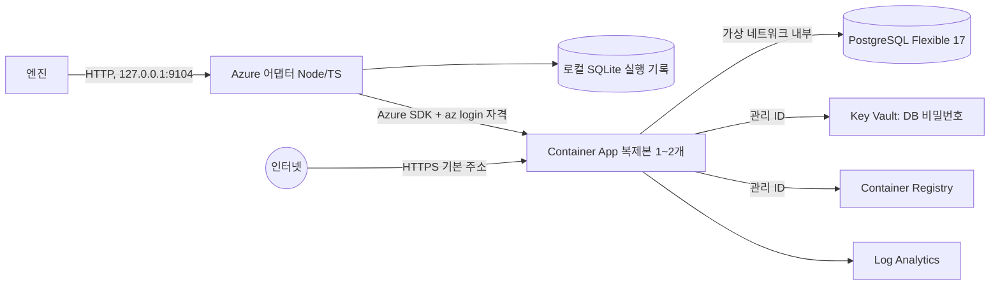

# Azure 배포 모듈: Container Apps + PostgreSQL (작업 명세)

> **상태: 작업 명세 v0.3 (2026-10-09)**. 담당: 서동옥. 아직 구현 전입니다.
> 규칙은 `packages/contracts/openapi/target.yaml`과 AWS 어댑터(`infra/aws`)를 그대로 따르고, 이 문서에는 **Azure에서 다른 점만** 적습니다.
> 실측이 필요한 가정과 팀 결정 사항은 마지막 "열린 항목" 한 곳에서 관리합니다.

## 1. 목표와 범위
- Action 한 번에 Local, AWS와 함께 **Azure에도 같은 이미지(같은 digest)**를 배포하고, **https 공개 주소**를 엔진에 돌려준다.
- 시연 앱(kty-board) 1개용 전용 인프라를 미리 만들어 두고, 배포 때는 앱 이미지와 설정만 바꾼다. (AWS와 같은 방식)
- 범위 밖: 배포 버튼으로 인프라 생성, 여러 프로젝트, 카나리, Blue/Green

## 2. 구성



| 역할 | Azure 리소스 | AWS 대응 |
|---|---|---|
| 앱 실행 | Container Apps (워크로드 프로필 환경의 Consumption 프로필, 단일 리비전 모드), linux/amd64 | ECS Fargate |
| 공개 주소 | 기본 ingress `*.azurecontainerapps.io`, 관리 인증서로 **HTTPS만** (http 거부) | ALB HTTP 80 |
| DB | PostgreSQL Flexible Server 17, Burstable B1ms, 공개 접근 끔 (Korea Central 지원 확인됨) | RDS PostgreSQL 17 |
| 비밀값 | Key Vault(RBAC) + 사용자 할당 관리 ID. 앱만 읽고 **어댑터는 비밀번호를 읽을 권한이 없음** | Secrets Manager + 실행 역할 |
| 이미지 저장소 | ACR Basic, 관리자 계정 끔, 관리 ID로만 pull | ECR |
| 로그 | Log Analytics (보관 30일: 최소값, 추가 비용 없음) | CloudWatch 7일 |
| 네트워크 | 가상 네트워크 1개: 앱 서브넷(`Microsoft.App/environments` 위임) + DB 서브넷(`Microsoft.DBforPostgreSQL/flexibleServers` 위임) + 비공개 DNS 영역 | VPC, 보안 그룹 |
| 인프라 정의 | Bicep | CloudFormation |

- 리전 Korea Central, 리소스 그룹 1개(`rg-shakedown-board`)에 전부 넣어 데모 후 한 번에 삭제한다.
- 가상 네트워크 구성이 Day1에 막히면 **대안**: DB 공개 접근 + "Azure 서비스 허용" 방화벽 + `sslmode=require`. 다른 Azure 고객도 접근 경로가 생기므로 대안으로만 쓴다.

## 3. AWS와 다른 점 (Target API)
입력 검증(`infra/aws/src/config.ts` `validateRequest`), 409·멱등·재시작 복구(`manager.ts`), loopback·Origin·Host 거절과 본문 32KB 제한(`app.ts`)은 **AWS와 동일**하다. 다른 점은 아래뿐이다.

| 항목 | Azure |
|---|---|
| `image` | 설정한 ACR 저장소의 `@sha256:` digest만 허용. 배포 전에 ACR에 그 digest가 있는지 확인, 없으면 400 |
| `options.sticky_sessions` | ingress 세션 고정으로 **지원 가능** (AWS는 false만). 실제로 열지는 팀 데모 규칙으로 결정 |
| 배포 | Container App **한 번의 갱신**으로 이미지·환경변수·복제본(최소=최대)·TZ·health 확인 경로·ingress 켜기를 같이 반영. 세션 고정만 바뀌면 앱 수준 변경이라 새 리비전을 만들지 않음 |
| `ready` | 새 리비전이 Healthy이고 트래픽 100% → **쿠키 없이 https health_path 200** (리다이렉트는 실패). AWS와 같은 기준 |
| 시간 제한 | AWS와 같게 준비 270초, 실패 시 정리 최대 120초 |
| DELETE | 한 번의 갱신으로 ingress 끄기 + 활성 리비전 비활성화 → 공개 주소가 앱 응답을 주지 않음을 확인 → 204. 오류는 502(재시도 가능), 이미 삭제된 ID는 204. DB·로그 보존 |
| 로그 | 최근 로그는 Container Apps 로그 스트림(거의 실시간), 이전 로그는 Log Analytics 한 번 조회 (반영이 수 분 늦음) |
| `info` | AWS와 같은 키: `runtime: Azure Container Apps`, `database: Azure PostgreSQL Flexible 17`, `session`, `timezone`, `sticky_sessions`, `image_digest`, `revision`, `transport: HTTPS` |
| `commands` | AWS와 같게 비움 (SDK로 호출하므로 실행하지 않은 CLI 명령을 적지 않음) |

어댑터 시작 시 한 번: 구독·테넌트가 설정과 같은지 확인(다르면 실행 거부, 회사 계정 보호), SDK 클라이언트 생성, PostgreSQL 서버가 중지 상태가 아닌지 확인.

## 4. 엔진·계약에 필요한 변경 (Azure 밖 작업, 김도경 님과 협의)
지금 엔진은 대상이 `local`, `aws`로 고정되어 있어 Azure를 끼우려면 엔진 수정이 필요하다 (`apps/engine/engine/deployments.py`).
- **대상 표 하나로 일반화**: 이름 → 어댑터 주소, 허용 옵션, 시간 제한, 이미지 저장소. 대상 목록 2개 제한, `aws` 하드코딩, 비교 대상 `Endpoint(name='aws')`를 이 표 기준으로 변경
- **이미지 게시 일반화**: 한 번 빌드한 digest를 선택된 대상마다 그 대상의 저장소로 `crane copy` (내용을 그대로 복사해 digest 유지). `docker push`를 두 번 하는 방식은 digest가 달라질 수 있어 쓰지 않음. 복사는 Local·AWS 배포와 동시에 진행. ECR→ACR 고정이 아니므로 Local+Azure만으로도 동작
- **계약 문서**: `target.yaml` 서버 목록에 9104 추가, 대상별 제약은 산문 대신 `packages/contracts/README.md`에 표 하나로 정리
- 대시보드: `apps/web/src/lib/targets.ts`에서 azure `available: true`

## 5. 설정 파일 (`.data/azure/config.json`, 비밀값 없음)
AWS `configSchema`와 같은 이름을 쓴다. Bicep 출력값에서 `config-from-outputs.ts`와 같은 방식으로 만든다.
```json
{
  "subscriptionId": "...", "tenantId": "...", "resourceGroup": "rg-shakedown-board",
  "projectId": "prj_board", "containerApp": "sd-app",
  "repositoryUri": "sdacr<접미사>.azurecr.io/shakedown-board",
  "publicUrl": "https://sd-app.<환경>.koreacentral.azurecontainerapps.io",
  "dbHost": "<서버>.postgres.database.azure.com", "dbName": "board_db", "dbUsername": "app",
  "dbPasswordSecretUri": "https://<볼트>.vault.azure.net/secrets/db-password",
  "port": 8080
}
```

## 6. 파일 구성
AWS 어댑터와 같은 구조에 `bicep/`(main: 기반, app: 앱과 스키마 초기화 작업), `src/azure-provider.ts`, `scripts/`(provision, publish-image, schema-init, session-check)를 추가한다. 각 파일 첫머리 주석에 역할과 이유를 적었다. `store.ts`, `manager.ts`와 `model.ts`의 Provider 인터페이스는 `target` 이름 외에 AWS 전용 내용이 없어서 공용으로 빼서 같이 쓴다 (김재환 님 합의 후. 합의 전이면 복사 후 나중에 합침).

## 7. 처음 한 번 준비 (비용 발생)
해커톤 구독은 무료 체험(지출 한도 켜짐)이라 크레딧을 넘겨 청구되지 않는다. 그래서 예산 알림은 생략한다.

```sh
export AZURE_SUBSCRIPTION_ID=<해커톤 구독 ID>
bash infra/azure/scripts/provision.sh what-if          # 서비스 등록 + 빈 리소스 그룹 + 바뀔 내용 확인
bash infra/azure/scripts/provision.sh                  # 기반(main.bicep) → 90초 대기 → 앱(app.bicep) → .data/azure/config.json
IMAGE=$(bash infra/azure/scripts/publish-image.sh)     # linux/amd64 단일 manifest로 ACR에 올리고 digest 주소 출력
bash infra/azure/scripts/schema-init.sh "$IMAGE"       # 스키마 초기화 작업 1회
npm run dev:azure                                      # Node 24 필요 (node:sqlite)
```

- 다시 돌려도 이미 만든 단계는 건너뛴다 (DB 비밀번호와 어댑터가 배포한 앱 유지)
- 정리: `az group delete -n rg-shakedown-board` 후 Key Vault 이름이 7일간 예약되므로 다시 만들 때는 `az keyvault purge -n <볼트>`

## 8. 테스트
- Azure 없이: `infra/aws/test/adapter.test.ts`의 항목을 가짜 Provider로 그대로 실행
- Azure에서: `scripts/session-check.py <공개 URL>`로 로그인 후 요청 20번의 로그인 유지 여부를 확인. 2026-10-09 결과는 `test/evidence/session-azure-2026-10-09.json` (session-memory 19/20 풀림, 세션 고정·session-jdbc 0/20)

## 9. 작업 목록과 공수

| 순서 | 할 일 | 공수 | 완료 기준 |
|---|---|---|---|
| 1 | 공용 코드 분리 + 어댑터 서버 + 설정 검증 | 0.5일 | AWS 테스트 항목이 가짜 Azure로 통과 |
| 2 | `azure-provider.ts`: 갱신, 리비전 상태, https 확인, 로그, DELETE | 0.5 ~ 1일 | SDK 경계 테스트 통과 |
| 3 | Bicep + `provision.sh` | 0.5일 | `what-if` 오류 없음 |
| 4 | 실제 준비 (서비스 등록, 예산, 생성, 스키마 초기화) | 0.5일 | https 주소에서 게시판 접속 |
| 5 | 엔진 일반화 (4절, 김도경 님과) + 대시보드 토글 + 계약 문서 | 0.5일 | Action 한 번에 Local·AWS·Azure 배포 |
| 6 | 데모 시나리오 확인 | 반나절 미만 | 시운전이 Azure에서 차단 → 수정 후 통과 |
| **합계** | | **2.5 ~ 3일** | |

오늘 1~3 (계정 없이 가능), Day1 4~6.

## 10. 예상 비용
PostgreSQL B1ms, ACR Basic, Container Apps(무료 제공량 안쪽 예상), 로그 합쳐 수천 원 ~ 1만 원대. 가장 큰 건 PostgreSQL이라 데모 사이에 중지할 수 있지만, 다시 켜는 데 수 분 걸리므로 데모 전에 미리 켠다.

## 11. 열린 항목

| 구분 | 내용 | 담당 |
|---|---|---|
| 결정 | 엔진 일반화(4절) 범위와 일정 | 김도경 |
| 결정 | 데모 수정 방식: 세션 고정(Azure 고유) vs `session-jdbc`(공통) | 팀 |
| 결정 | 어댑터 공용 코드 분리 | 김재환 |
| 결정 | Azure 비용이 해커톤 지원금 대상인지 | 운영진 문의 |
| 결정 | 샘플 앱 `X-Instance-Id`가 Azure에서 모두 `local` (HOSTNAME 미설정). `DemoInstanceFilter`가 `CONTAINER_APP_REPLICA_NAME`도 보도록 수정 필요 | 샘플 담당 |
| 결정 | 서비스 간 토큰 헤더 (모든 어댑터가 127.0.0.1만 열어 이번엔 생략 가능) | 팀 |
| 확인됨 | 앱 서브넷 /23으로 Container Apps 환경 생성 성공 (3분 21초) | - |
| 확인됨 | 새 리비전 준비 시간: POST부터 ready까지 59초 (복제본 2, 2026-10-09) | - |
| 확인됨 | ingress를 끈 뒤 공개 주소는 404 (DELETE 완료 판정 기준) | - |
| 확인됨 | Korea Central PostgreSQL 17·B1ms 지원 (2026-10-09 `list-skus`) | - |
| 확인됨 | 최소=최대 복제본이면 리비전 상태가 `Running`이 아닌 `RunningAtMaxScale` (SDK 타입에 없음) | - |
| 확인됨 | http 접속은 https로 301 리다이렉트 | - |
| 확인됨 | 엔진 전체 흐름(Local+Azure, 2026-10-09): session-memory는 BLOCKED → 로그 수집 → DELETE 확인 → 공개 주소 404, 세션 고정은 promoted (배포~판정 약 3분) | - |
| 결정 | 클라우드와 같은 amd64 이미지를 ARM Mac Local에서 에뮬레이션으로 돌리면 Spring 시작이 느려 Local 확인 시간 제한을 넘길 때가 있음 | Local 담당 |
