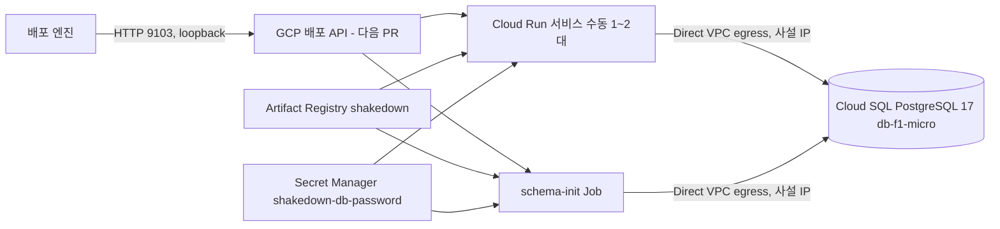

# GCP 배포 모듈 — Cloud Run + Cloud SQL PostgreSQL

김태현 담당. 엔진이 "GCP에 배포해"라고 부르면 Cloud Run에 샘플 앱을 띄우고 공개 주소를 돌려주는 모듈입니다. 지금은 1회 준비 스크립트, 이미지 올리기 스크립트, 실측 결과까지 들어 있고, 엔진이 부를 배포 API(127.0.0.1:9103)는 다음 PR에서 붙습니다.

## 구성



- 프로젝트 `shakedown-511106`(번호 `700410260240`), 리전 서울 `asia-northeast3`.
- Cloud SQL에는 공개 IP가 없습니다. VPC `default`와 Google 서비스망을 피어링(Private Services Access)해 사설 IP로만 붙습니다.
- DB 비밀번호는 Secret Manager에만 있습니다. 설정 파일·화면·명령 인자·gcloud 로그 파일에 나오지 않습니다. Cloud Run은 실행 계정(Compute Engine 기본 서비스 계정)으로 꺼내 씁니다.

## GCP 없이 검증

저장소 루트, Node 24 이상:

```sh
npm ci --ignore-scripts
npm test -w @shakedown/gcp
npm run check -w @shakedown/gcp
```

가짜 gcloud·docker·openssl을 PATH 앞에 두고 두 스크립트를 돌립니다. 자원 생성 순서, 다시 실행하면 아무것도 만들지 않음, 비밀번호가 화면·호출 기록·설정 파일에 없음, 다른 프로젝트를 가리키면 아무것도 바꾸지 않음, 이미지 결과가 한 줄인지 확인합니다.

## 1회 준비 (비용 발생)

```sh
gcloud config set project shakedown-511106
bash infra/gcp/scripts/provision.sh shakedown-511106
```

- 하는 일: API 8개 켜기 → Artifact Registry 저장소 `shakedown` → 사설망 대역 `shakedown-psa`(/16)와 피어링 → Cloud SQL `shakedown-pg`(PostgreSQL 17, Enterprise, db-f1-micro, 단일 영역, 사설 IP만) → DB `board_db` → 비밀번호 생성 후 Secret Manager `shakedown-db-password`에 저장 → 사용자 `board` → 실행 계정에 비밀값 읽기 권한 → 설정 파일.
- 설정 파일: 기본 `infra/gcp/.data/config.json`(Git 제외). 두 번째 인자로 경로를 바꿀 수 있습니다. 엔진의 project_id가 `prj_board`가 아니면 `GCP_APP_PROJECT_ID=그값`을 앞에 붙여 실행합니다.
- 다시 실행해도 안전합니다. 있는 자원은 건드리지 않고 설정 파일만 다시 씁니다. 중간에 멈췄으면 같은 명령을 다시 실행합니다.
- gcloud 현재 프로젝트가 인자와 다르면 아무것도 바꾸지 않고 멈춥니다.

## 이미지 올리기

```sh
gcloud auth configure-docker asia-northeast3-docker.pkg.dev   # 1회
bash infra/gcp/scripts/publish-image.sh "$(git rev-parse --short HEAD)"
```

`samples/kty-board`를 linux/amd64 단일 manifest(provenance·sbom 끔)로 빌드해 설정 파일의 허용 저장소(`imagePrefixes[0]`, 기본 `asia-northeast3-docker.pkg.dev/shakedown-511106/shakedown/`) 아래 `kty-board`에 커밋 태그로 올리고, 표준출력에 `저장소@sha256:digest` 한 줄만 냅니다. 배포 요청의 image에는 이 줄을 그대로 씁니다. 설정 파일이 없으면 provision.sh를 먼저 실행하라고 알리고 멈춥니다. 다른 설정 파일은 두 번째 인자로 줍니다.

## 실측 결과 (2026-10-09)

`scripts/spike.sh`로 임시 서비스 `shakedown-spike`(수동 2대, Direct VPC egress, session-memory, 스티키 끔)와 schema-init Job을 띄워 쟀습니다. 임시 자원은 끝에서 지웠습니다.

```sh
bash infra/gcp/scripts/spike.sh "$(cat infra/gcp/.data/image.txt)"
```

| 항목 | 결과 | 기준 | 판정 |
|---|---|---|---|
| Cloud SQL 생성 시간 | 340초 | 기록 | - |
| a 로그인 풀림 (/board 20회) | 6회 튕김 | - | 풀림 있음 — GCP에서도 session-memory 차단 장면 가능 |
| b 0대로 내린 뒤 2xx 아님 | 2초 (HTTP 503) | 20초 이하 | 유지 |
| c allUsers 회수 후 403 | 14초 | 기록 | - |
| c allUsers 재부여 후 200 | 1초 | 270초 이하 | 유지 — 배포 맨 앞에서 allUsers 부여 |
| d X-Instance-Id 종류 / 인스턴스 | 1개 / 2개 | - | 구별 불가 — X-Instance-Id를 시운전 증거로 못 씀 |
| e 기동 후 DB 첫 연결 | 4.1초, 4.2초 | 배포 성공 | 견딤 |
| f Job + 배포 + 첫 health | 49초 (30 + 19 + 0) | 270초 이하 | 매 배포 유지 |

## 비용 멈추기

과금되는 것: Cloud SQL(켜져 있는 동안 시간당, 멈춰도 저장공간·IP), Cloud Run 수동 스케일링 인스턴스(요청이 없어도 과금), Artifact Registry 저장 용량, Secret Manager, 로그.

- 앱 끄기: 다음 PR의 배포 API DELETE가 0대로 내립니다. 손으로 지우려면 `gcloud run services delete shakedown-board --region=asia-northeast3`, `gcloud run jobs delete shakedown-board-schema --region=asia-northeast3`.
- DB 멈추기(데이터 보존): `gcloud sql instances patch shakedown-pg --activation-policy=never`. 다시 켜기는 `--activation-policy=always`. 멈춰도 저장공간과 IP 요금은 계속됩니다.
- 전부 정리(데이터 삭제, 되돌릴 수 없음): `gcloud sql instances delete shakedown-pg`, `gcloud artifacts repositories delete shakedown --location=asia-northeast3`, `gcloud secrets delete shakedown-db-password`. 같은 인스턴스 이름은 지운 뒤 바로 다시 쓸 수 있습니다.
- 체험 크레딧 만료(2027-01-08) 전에 정리합니다.

참고: [Cloud Run 수동 스케일링](https://docs.cloud.google.com/run/docs/configuring/services/manual-scaling), [Direct VPC egress](https://docs.cloud.google.com/run/docs/configuring/vpc-direct-vpc), [Cloud SQL 사설 IP](https://docs.cloud.google.com/sql/docs/postgres/configure-private-ip), [Cloud SQL 시작·중지](https://docs.cloud.google.com/sql/docs/postgres/start-stop-restart-instance).
