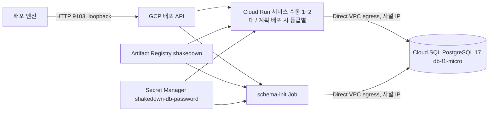
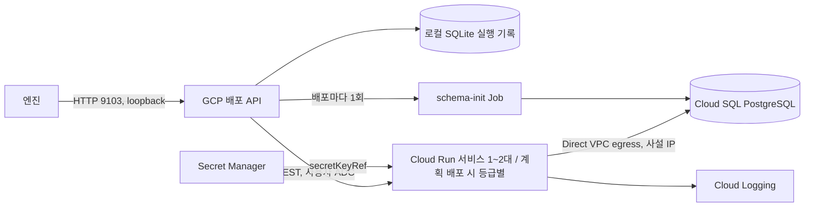

# GCP 배포 모듈 — Cloud Run + Cloud SQL PostgreSQL

김태현 담당. 엔진이 "GCP에 배포해"라고 부르면 Cloud Run에 샘플 앱을 띄우고 공개 주소를 돌려주는 모듈입니다. 1회 준비 스크립트, 이미지 올리기 스크립트, 실측 결과, 엔진이 부르는 배포 API(127.0.0.1:9103)가 들어 있습니다.

## 구성



- 프로젝트 `shakedown-511106`(번호 `700410260240`), 리전 서울 `asia-northeast3`.
- Cloud SQL에는 공개 IP가 없습니다. VPC `default`와 Google 서비스망을 피어링(Private Services Access)해 사설 IP로만 붙습니다.
- DB 비밀번호는 Secret Manager에만 있습니다. 설정 파일·화면·명령 인자·gcloud 로그 파일에 나오지 않습니다. Cloud Run은 실행 계정(Compute Engine 기본 서비스 계정)으로 꺼내 씁니다.

## GCP 없이 검증

저장소 루트, Node 24 이상:

```sh
npm ci --ignore-scripts
npm test -w @shakedown/gcp
npm run check -w @shakedown/gcp
```

가짜 gcloud·docker·openssl을 PATH 앞에 두고 두 스크립트를 돌립니다. 자원 생성 순서, 다시 실행하면 아무것도 만들지 않음, 비밀번호가 화면·호출 기록·설정 파일에 없음, 다른 프로젝트를 가리키면 아무것도 바꾸지 않음, 이미지 결과가 한 줄인지 확인합니다. 배포 API 시험은 아래 "테스트" 절에 있습니다.

## 1회 준비 (비용 발생)

```sh
gcloud config set project shakedown-511106
bash infra/gcp/scripts/provision.sh shakedown-511106
```

- 하는 일: API 8개 켜기 → Artifact Registry 저장소 `shakedown` → 사설망 대역 `shakedown-psa`(/16)와 피어링 → Cloud SQL `shakedown-pg`(PostgreSQL 17, Enterprise, db-f1-micro, 단일 영역, 사설 IP만) → DB `board_db` → 비밀번호 생성 후 Secret Manager `shakedown-db-password`에 저장 → 사용자 `board` → 실행 계정에 비밀값 읽기 권한 → 설정 파일.
- 설정 파일: 기본 `infra/gcp/.data/config.json`(Git 제외). 두 번째 인자로 경로를 바꿀 수 있습니다. 엔진의 project_id가 `prj_board`가 아니면 `GCP_APP_PROJECT_ID=그값`을 앞에 붙여 실행합니다.
- 다시 실행해도 안전합니다. 있는 자원은 건드리지 않고 설정 파일만 다시 씁니다. 중간에 멈췄으면 같은 명령을 다시 실행합니다.
- gcloud 현재 프로젝트가 인자와 다르면 아무것도 바꾸지 않고 멈춥니다.

## 이미지 올리기

```sh
gcloud auth configure-docker asia-northeast3-docker.pkg.dev   # 1회
bash infra/gcp/scripts/publish-image.sh "$(git rev-parse --short HEAD)"
```

`samples/kty-board`를 linux/amd64 단일 manifest(provenance·sbom 끔)로 빌드해 설정 파일의 허용 저장소(`imagePrefixes[0]`, 기본 `asia-northeast3-docker.pkg.dev/shakedown-511106/shakedown/`) 아래 `kty-board`에 커밋 태그로 올리고, 표준출력에 `저장소@sha256:digest` 한 줄만 냅니다. 배포 요청의 image에는 이 줄을 그대로 씁니다. 설정 파일이 없으면 provision.sh를 먼저 실행하라고 알리고 멈춥니다. 다른 설정 파일은 두 번째 인자로 줍니다.

## 실측 결과 (2026-10-09)

`scripts/spike.sh`로 임시 서비스 `shakedown-spike`(수동 2대, Direct VPC egress, session-memory, 스티키 끔)와 schema-init Job을 띄워 쟀습니다. 임시 자원은 끝에서 지웠습니다.

```sh
bash infra/gcp/scripts/spike.sh "$(cat infra/gcp/.data/image.txt)"
```

| 항목 | 결과 | 기준 | 판정 |
|---|---|---|---|
| Cloud SQL 생성 시간 | 340초 | 기록 | - |
| a 로그인 풀림 (/board 20회) | 6회 튕김 | - | 풀림 있음 — GCP에서도 session-memory 차단 장면 가능 |
| b 0대로 내린 뒤 2xx 아님 | 2초 (HTTP 503) | 20초 이하 | 유지 |
| c allUsers 회수 후 403 | 14초 | 기록 | - |
| c allUsers 재부여 후 200 | 1초 | 270초 이하 | 유지 — 배포 맨 앞에서 allUsers 부여 |
| d X-Instance-Id 종류 / 인스턴스 | 1개 / 2개 | - | 그때 이미지(`c800229…`)로는 구별 불가 — HOSTNAME이 없어 두 대 모두 기본값 `local`. 샘플 앱이 HOSTNAME이 없으면 서버마다 무작위 `i-xxxxxxxx`를 내도록 바뀌어서 새 이미지로 다시 잴 항목(결과 TBD, 기대 2개 / 2개) |
| e 기동 후 DB 첫 연결 | 4.1초, 4.2초 | 배포 성공 | 견딤 |
| f Job + 배포 + 첫 health | 49초 (30 + 19 + 0) | 270초 이하 | 매 배포 유지 |


### 배포 API로 실측 (2026-10-09)

배포 API(`npm run dev:gcp`)를 실제 설정으로 띄우고 curl로 직접 불렀습니다. 엔진은 거치지 않았습니다. 요청: replicas 2, `demo,session-memory`, health `/health`, 이미지 `kty-board@sha256:c8002296539f…`.

| 항목 | 기준 | 결과 |
|---|---|---|
| POST → ready | 270초 이내 | 54초 (schema-init 27초, 서비스 생성 23초, 권한 1초, health 1초) |
| ready 응답 | instances 2, run.app 주소 | instances 2, `https://shakedown-board-700410260240.asia-northeast3.run.app` |
| 공개 주소 /health | 리다이렉트 없이 200 | 200 |
| 로그 API | deploy·app 줄, 200줄 이하, 비밀 가림 | 전체 59줄 (deploy 13, app 46), 비밀 노출 없음 |
| DELETE | 20초 이내 204 | 204, 2.6초 |
| DELETE 뒤 GET / logs | 404 / 200 | 404 / 200 |
| DELETE 직후 공개 주소 | 200 아님 | 503 (`Service is disabled`) |
| 공개 주소 403까지 | IAM 반영 보통 2분, 길면 7분 이상 | 10분 안에 403이 되지 않음. 0대인 동안은 503이 계속됨 |
| IAM 정책의 allUsers | DELETE 뒤 없음 | 없음 (DELETE 뒤 1초에 제거 로그) |
| 서비스 대수 | manualInstanceCount 0 | 0 |
| 리비전 이름 지정 재배포 (session-jdbc, 스티키 켬, 1대) | 270초 이내, 그 배포 리비전 로그만 | 54초, `shakedown-board-82fc70c10bba`, 앱 로그 44줄이 그 리비전 시작부터. DELETE 204 2.95초 |

## 배포 API 실행

엔진이 부르는 GCP 배포 API를 `127.0.0.1:9103`에 띄웁니다. 한 프로세스가 Cloud Run 서비스 하나(설정의 `serviceName`)만 다룹니다.



준비물
- Node 24 이상. 저장소 루트에서 `npm ci --ignore-scripts`를 한 번 실행합니다.
- 준비 스크립트(`scripts/provision.sh`)가 만든 설정 파일(예: `infra/gcp/.data/config.json`).
- gcloud 사용자 로그인(ADC). 키 파일은 쓰지 않습니다.

```sh
gcloud auth application-default login
gcloud auth application-default set-quota-project shakedown-511106
```

어댑터는 모든 GCP 요청에 `x-goog-user-project: <gcpProject>` 헤더를 붙여 요금·한도를 이 프로젝트에 매깁니다.

실행 (저장소 루트):

```sh
export GCP_ADAPTER_CONFIG="$PWD/infra/gcp/.data/config.json"
export GCP_ADAPTER_DB="$PWD/infra/gcp/.data/gcp.sqlite3"
npm run dev:gcp
```

`GCP adapter listening on http://127.0.0.1:9103`이 나오면 준비가 끝난 것입니다. `curl -sS http://127.0.0.1:9103/health` → `{"ok":true,"target":"gcp"}`.

기동 순서와 이유
1. 설정 파일 검사. 형식이 틀리거나 모르는 키가 있으면 바로 멈춥니다.
2. 잠금 파일 `<GCP_ADAPTER_DB>.lock` 생성. 두 프로세스가 같은 서비스를 동시에 움직이지 않게 합니다. 비정상 종료로 남았다면 안에 적힌 PID가 끝났는지 확인한 뒤에만 지웁니다.
3. 프로젝트 확인(`verifyProject`). 로그인한 계정으로 설정의 프로젝트를 조회해 프로젝트 ID와 번호가 둘 다 같은지 봅니다. 다르면 아무것도 바꾸기 전에 멈춥니다.
4. 상태 DB를 이 프로젝트·리전·서비스·Job·엔진 project_id에 묶습니다. 다른 설정으로 같은 DB를 열면 거부합니다.
5. 끊긴 배포 복구(아래 "상태와 오류 규칙").
6. 포트를 엽니다.

멈추기: Ctrl+C. 진행 중인 배포와 뒤에서 도는 공개 권한 제거(최대 30초)가 끝나기를 기다린 뒤 종료하고 잠금 파일을 지웁니다. 강제 종료(kill -9)하면 잠금 파일과 공개 권한이 남을 수 있습니다.

## 설정 파일

비밀값이 들어가지 않습니다. 그래도 `.data/`는 커밋하지 않습니다(.gitignore). 모양은 `config.example.json`을 봅니다.

| 필드 | 뜻 | 예 |
|---|---|---|
| `gcpProject` | GCP 프로젝트 ID | `shakedown-511106` |
| `gcpProjectNumber` | 프로젝트 번호. 기동 확인과 공개 주소에 씁니다 | `700410260240` |
| `region` | 서울만 허용 | `asia-northeast3` |
| `projectId` | 엔진이 프로젝트 등록 때 만든 ID. 요청의 `project_id`와 같아야 합니다 | `prj_` + 16자리 |
| `serviceName` | Cloud Run 서비스 이름 | `shakedown-board` |
| `jobName` | schema-init용 Cloud Run Job 이름 | `shakedown-board-schema` |
| `imagePrefixes` | 허용 이미지 저장소 접두어 목록. 요청 image는 이 중 하나로 시작하고 `@sha256:` digest여야 합니다 | `["asia-northeast3-docker.pkg.dev/shakedown-511106/shakedown/"]` |
| `network`, `subnetwork` | 앱이 사설망으로 나갈 VPC와 서브넷(Direct VPC egress) | `default`, `default` |
| `dbHost` | Cloud SQL 사설 IP | 준비 스크립트 출력값 |
| `dbName`, `dbUsername` | DB 이름과 사용자. 요청의 `database.name`은 `dbName`과 같아야 합니다 | 준비 스크립트 출력값 |
| `dbPasswordSecret` | DB 비밀번호가 든 Secret Manager 비밀의 **이름**. Cloud Run이 최신 버전을 꺼내 `SPRING_DATASOURCE_PASSWORD`로 넣습니다 | 준비 스크립트 출력값 |
| `port` | 앱 컨테이너 포트. 요청의 `port`와 같아야 합니다 | `8080` |
| `memory`, `cpu` | 인스턴스 사양 | `1Gi`, `1` |

- 공개 주소는 설정으로 정해집니다: `https://{serviceName}-{gcpProjectNumber}.asia-northeast3.run.app`.
- 이미지를 Docker Hub 원격 저장소로 옮기면 `imagePrefixes`만 바꿉니다.

## 엔진 연결

엔진은 `packages/contracts/openapi/target.yaml`대로 부릅니다. `POST /deployments` → 202 → 주기적으로 `GET /deployments/{id}`(계약서 권장 2~3초, 지금 엔진은 1초) → `ready`면 `url`로 시운전 → 끝나면 `DELETE`.

요청 예:

```json
{
  "deployment_id": "dep_demo01",
  "project_id": "prj_0123456789abcdef",
  "image": "asia-northeast3-docker.pkg.dev/shakedown-511106/shakedown/kty-board@sha256:aaaaaaaaaaaaaaaaaaaaaaaaaaaaaaaaaaaaaaaaaaaaaaaaaaaaaaaaaaaaaaaa",
  "port": 8080,
  "health_path": "/health",
  "env": { "SPRING_PROFILES_ACTIVE": "demo,session-memory" },
  "secret_refs": { "SPRING_DATASOURCE_PASSWORD": "db_password" },
  "database": { "engine": "postgres", "name": "board_db" },
  "options": { "replicas": 2, "sticky_sessions": false, "tz": "UTC" }
}
```

ready 응답 예:

```json
{
  "deployment_id": "dep_demo01",
  "target": "gcp",
  "status": "ready",
  "url": "https://shakedown-board-700410260240.asia-northeast3.run.app",
  "instances": 2,
  "started_at": "2026-10-09T05:12:03.000Z",
  "ready_at": "2026-10-09T05:15:10.000Z",
  "info": {
    "runtime": "Cloud Run", "region": "asia-northeast3", "database": "Cloud SQL PostgreSQL",
    "session": "memory", "sticky_sessions": "false", "image_digest": "sha256:aaaaaaaaaaaaaaaaaaaaaaaaaaaaaaaaaaaaaaaaaaaaaaaaaaaaaaaaaaaaaaaa",
    "revision": "shakedown-board-322d173852dd", "scaling": "manual", "architecture": "legacy"
  }
}
```

엔진이 맞춰야 할 것 (엔진 수정은 별도 PR `feat/engine-gcp-target`)
- 이미지: `linux/amd64`로 빌드해 허용 저장소에 push하고 `image@sha256:…`을 보냅니다. 태그는 받지 않습니다.
- 주소: `https://…run.app`을 공개 주소로 받아들입니다.
- 대기: 배포는 270초 안에 `ready` 또는 `failed`가 됩니다. 엔진의 5분 제한 안입니다.
- DELETE: 보통 20초 안에 204입니다. 204 뒤 공개 주소는 403이 아니라 503(`Service is disabled`)입니다(아래 "내리기").
- env는 `SPRING_PROFILES_ACTIVE` 하나, secret_refs는 `SPRING_DATASOURCE_PASSWORD: db_password` 하나만 받습니다. 프로필을 빼면 `demo,session-memory`입니다. 실행 설정(runtime)을 보내면 아래 "범용 런타임" 절의 규칙을 따릅니다.
- 계획 배포는 아래 "계획 배포" 절의 모양으로 보냅니다.

## 계획 배포 (gcp-architecture.v1)

엔진의 아키텍처 판단(소·중·대) 결과를 붙여 보내면 그 등급의 CPU·메모리·대수·자동 확장으로 Cloud Run을 띄웁니다. 요청은 버전과 등급 이름만 담고, 사양은 `src/architecture.ts`의 서버 카탈로그가 정합니다(AWS 어댑터와 같은 원칙). `architecture`가 없는 요청은 이 기능 전과 같은 본문으로 배포합니다(테스트가 PATCH 본문을 바이트 단위로 비교).

지금 엔진은 계획을 AWS에만 보냅니다. GCP로도 보내는 일은 엔진 플래너 일반화(서동옥 님 "작업 2", `infra/azure/README.md` 12절)에서 합니다. 그 전까지 이 경로는 어댑터를 직접 불러야만 탑니다.

**해커톤 범위: compute만 적용, DB 고가용성은 계획만.** Azure(`infra/azure/README.md` 12절)와 같은 방식입니다. Cloud SQL은 어느 등급이든 지금 그대로(PostgreSQL 17, db-f1-micro, 단일 영역)이고 어댑터는 Cloud SQL을 읽지도 바꾸지도 않습니다. 고가용성(REGIONAL·전용 코어)으로 바꾸려면 재시작, 최대 1시간, 비용, 승인이 필요해 데모 전에 맞추기 어렵습니다. 그래서 엔진 계획서에만 "운영 전환 때 필요"로 남깁니다(아래 "접은 계획").

요청에서 달라지는 칸:

```json
{
  "architecture": { "version": "gcp-architecture.v1", "template_id": "medium" },
  "env": { "SPRING_PROFILES_ACTIVE": "demo,session-jdbc" },
  "options": { "replicas": 2, "sticky_sessions": false, "tz": "UTC" }
}
```

| 등급 | Cloud Run (인스턴스당) | 확장 | 앱 DB 연결 풀 (인스턴스당) | DB 고가용성 |
|---|---|---|---|---|
| small | 1 vCPU / 1Gi | 수동 1대 | 앱 기본값(10) | 계획만 |
| medium | 1 vCPU / 2Gi | 자동 2~4대 | 5 | 계획만 |
| large | 2 vCPU / 4Gi | 자동 3~8대 | 2 | 계획만 |

- small은 1 vCPU입니다. Cloud Run은 1 vCPU 미만이면 동시 요청 1개를 강제해 Local과의 비교가 틀어집니다.
- large 최대 8대: 서울 리전 Cloud Run 쿼터가 CPU 20 vCPU, 메모리 40 GiB입니다(2026-10-09 Service Usage 조회). 2 vCPU·4Gi면 10대가 상한이고, schema-init Job(1 vCPU / 1Gi)과 롤아웃 중 새 인스턴스 1대 몫을 남겼습니다(8 × 2 + 1 + 2 = 19 vCPU). 최대 대수로 늘어난 채 다시 배포하면 새 리비전 min 3대가 다 들어가지 못합니다(아래 데모 체크리스트 1). 무료 체험 계정은 쿼터 상향을 요청할 수 없습니다. `test/architecture.test.ts`가 모든 등급이 쿼터 안인지 확인합니다.
- 같은 이름이라도 AWS와 사양이 다릅니다(AWS small 0.5 vCPU, large 3~12대).
- 자동 확장은 서비스 수준 min/max와 리비전 수준 max를 같은 값으로 적습니다. 서버가 리비전 max를 따로 채우는 경우가 있어서입니다(2026-10-09 v2 GET에서 `template.scaling.maxInstanceCount=3` 확인). 실제 상한은 둘 중 작은 값이라, 준비 뒤 서비스를 다시 읽어(`phase=verify_scaling`) 범위가 카탈로그와 다르면 공개 확인(`public_health`) 전에 실패하고 0대로 내립니다. "공개 전"은 아닙니다. 이미 있는 서비스는 공개 권한을 맨 앞에서 주므로, 이때 새 리비전은 이미 공개 주소로 답하고 있습니다.
- 연결 풀: 지금 Cloud SQL(db-f1-micro)은 `max_connections`가 25이고 관리용 예약 몇 개를 빼면 앱 몫은 약 22개입니다. 자동 확장으로 최대 대수까지 늘어도 넘치지 않게 "최대 대수 × 인스턴스당 풀"을 20 이하로 둡니다. medium 4 × 5 = 20, large 8 × 2 = 16, small 1 × 10 = 10. 계획 배포 앱에만 `SPRING_DATASOURCE_HIKARI_MAXIMUMPOOLSIZE`로 넣고(small은 넣지 않음), schema-init Job(앱 갱신 전에 끝남)과 계획 없는 배포는 기본값 그대로입니다. `test/architecture.test.ts`가 이 계산을 지킵니다. schema-init Job의 연결(기본 10)과 롤아웃 중 이전 리비전의 연결은 이 예산 밖입니다. 겹침까지 넣으면 large 풀이 1이 되어 인스턴스마다 DB 작업이 한 번에 하나씩만 돕니다. 대신 계획 배포 전에 이전 배포를 DELETE합니다(데모 체크리스트 1). 엔진의 수정 적용 재배포는 1회차 정리 확인(0대) 뒤에만 돌아서 겹치지 않습니다.
- 제한 시간은 계획 배포도 270초입니다.

**400 (받기 전에 거절)**: 다른 카탈로그 버전(`aws-architecture.v1` 등)이나 모르는 등급·칸, `replicas`가 등급 시작 대수(small 1, medium 2, large 3)와 다름, 프로필이 `demo,session-jdbc`가 아님(자동 확장으로 대수가 바뀌면 메모리 세션은 로그인이 풀림), `sticky_sessions=true`(세션 어피니티는 자동 확장 중에 끊길 수 있어 AWS 계획 배포와 같은 규칙). 계획 없는 요청은 지금처럼 replicas 1~2, 스티키 허용입니다.

**ready 응답 info**: `architecture`(등급, 계획 없는 배포는 AWS·Azure와 같이 `legacy`), `scaling`(다시 읽은 실제 범위 `automatic 2-4`, small과 계획 없는 배포는 `manual`). `instances`는 시작 대수(min)입니다. DB 등급·고가용성은 적용하지 않으므로 적지 않습니다. Cloud Run은 인스턴스가 어느 영역에 놓이는지 보장하지 않아 영역 수도 적지 않습니다.

**계약**: `target.yaml` v0.1.3(제안, 팀 채널 공유 TBD)의 `DeployRequest.architecture`와 "GCP 구현 제약" 절의 계획 배포 줄입니다.

### 데모 체크리스트

1. 계획 배포 전에는 이전 배포를 DELETE합니다. 이전 배포가 떠 있으면 schema-init Job(연결 10)과 롤아웃 동안 이전 리비전의 DB 연결(수동 2대면 최대 20, medium이 4대로 늘었으면 20)·CPU 쿼터가 겹쳐 연결 한도나 쿼터를 넘을 수 있습니다.
2. 끝나면 최신 배포를 DELETE합니다(수동 0대, 자동 확장 min/max도 지움. 아래 "내리기").

### 접은 계획: DB 고가용성 2단계 (2026-10-10)

PR #20 첫 버전은 medium·large에서 미리 고가용성으로 바꿔 둔 Cloud SQL(REGIONAL·`db-custom-1-3840`)을 요구했습니다. 배포 전에 Cloud SQL Admin API로 등급·상태·진행 중 작업을 읽어 확인하고(`phase=check_database`), 전환은 데모 1시간 전에 `scripts/database.sh ha --yes`로 하는 2단계였습니다. 전환이 재시작·최대 1시간·비용·승인을 요구해 데모 전에 맞추기 어려워 접었고, 그 코드(DB 확인, `database.sh`, 설정의 `dbInstance`)는 이 모듈에 없습니다. 운영 전환 때 다시 볼 것:

- Cloud SQL REGIONAL + 전용 코어(`db-custom-1-3840`, 연결 100). HA는 백업·PITR이 먼저 켜져 있어야 합니다.
- 연결 풀을 새 연결 한도에 맞춰 다시 계산합니다.
- 비용(2026-10-09 서울 단가, 계산 비용만): db-f1-micro ZONAL 약 $0.0137/h, db-custom-1-3840 REGIONAL 약 $0.1757/h. HA를 한 달 켜 두면 약 $128 이상이라 월 예산 알림(₩70,000)을 넘습니다.

### 계획 배포 실측 (2026-10-10)

어댑터를 직접 불러 실제 서비스(shakedown-board, Cloud SQL db-f1-micro ZONAL)에서 확인했습니다. 설정 값은 `gcloud run services describe`로 다시 읽었습니다. 끝난 뒤 서비스는 0대, allUsers 없음.

| 항목 | 기준 | 결과 |
|---|---|---|
| `validateOnly=true`로 medium·large 본문(GA) 수락, 서버가 채우는 값 | 수락, 리비전 max가 요청과 같음 | 생략. 아래 실제 배포로 같은 본문이 수락되고 리비전 max가 요청과 같음을 확인 |
| `validateOnly=true`로 내리기 마스크(MANUAL 0 + min/max 지움) 수락 | 수락 | 생략. 아래 medium DELETE로 확인 |
| 계획 없는 배포(회귀) | 54초 안팎, MANUAL, 1/1Gi | 통과. POST→ready 54초(Job 25초·서비스 23초), info.architecture=legacy, DELETE 2.1초 뒤 503 |
| small 계획 배포 | ready, info.architecture=small, scaling manual, 풀 env 없음 | 통과. 54초, DELETE 1.9초 뒤 503 |
| medium 계획 배포 | ready, AUTOMATIC 2~4, 리비전 max 4, 1/2Gi, pool 5, POST→ready 시간 | 통과. 54초(Job 26초·서비스 25초), 서비스 automatic min 2·max 4, 리비전 max 4, 1 vCPU/2Gi, info.scaling `automatic 2-4` |
| medium DELETE | 20초 안 204, MANUAL 0, 서비스 min/max 없음, 503 | 통과. 3초, manual 0, min/max 없음, 503 |
| large 계획 배포 | min 3, 리비전 max 8, 2/4Gi, pool 2, 기동·첫 DB 연결 시간(Direct VPC) | 통과. 46초(Job 24초·서비스 16초), 서비스 min 3·max 8, 리비전 max 8, 2 vCPU/4Gi, `SPRING_DATASOURCE_HIKARI_MAXIMUMPOOLSIZE=2` |
| 계획 없는 배포로 복귀 | MANUAL 2, 서비스 min/max 없음 | 통과. large가 떠 있는 위에 덮어써 54초, manual 2, min/max 없음, 1/1Gi, 풀 env 없음 |

## 범용 런타임 (http-runtime.v1)

엔진에 실행 설정(`project.runtime`)을 저장한 프로젝트는 Spring 샘플이 아니어도 배포합니다. 엔진은 `runtime`을 그대로 보내고, `database`·`secret_refs`·`env`를 빼고, `port`·`health_path`를 runtime 값으로 맞춥니다. Azure 어댑터와 같은 방식이고, DB는 GCP에 준비된 것만 받습니다.

```json
{
  "deployment_id": "dep_demo02", "project_id": "prj_0123456789abcdef", "image": "…/kty-board@sha256:…",
  "port": 3000, "health_path": "/healthz",
  "runtime": {
    "version": "http-runtime.v1", "port": 3000, "health_path": "/healthz",
    "env": { "NODE_ENV": "production" },
    "secret_refs": { "APP_DB_PASSWORD": "db_password" },
    "database": { "mode": "postgres", "name": "board_db", "bindings": { "DB_URL": "jdbc_url", "DB_USER": "username", "DB_PASSWORD": "password" } },
    "init_command": ["npm", "run", "migrate"]
  },
  "options": { "replicas": 2, "sticky_sessions": false, "tz": "UTC" }
}
```

| 항목 | GCP에서 받는 것 |
|---|---|
| `database.mode` | `none` 또는 `postgres`(설정의 Cloud SQL, 이름은 `dbName`과 같아야 함). `mysql`·`mongodb`·`external`은 400 |
| `database.bindings` | `host`·`port`·`name`·`username`·`jdbc_url`(평문), `password`(Secret Manager). `postgres_url`은 400: URL에 비밀번호가 들어가는데 어댑터는 Secret Manager 값을 모릅니다 |
| `secret_refs` | 값은 `db_password`만(Secret Manager의 `dbPasswordSecret`). 다른 비밀 이름은 400. DB가 `none`이면 줄 비밀이 없어 비워야 합니다(최소 권한) |
| `init_command` | 같은 이미지·같은 env로 schema Job에서 한 번 실행. 첫 칸이 실행 파일(`command`), 나머지가 인자(`args`). 셸을 거치지 않습니다. 비어 있으면 Job을 건너뜁니다 |
| `port` | 제한 없음. Cloud Run은 리비전마다 `containerPort`를 정합니다. 옛 방식만 설정 `port`에 묶입니다 |
| 환경변수 이름 | Cloud Run 컨테이너 런타임 계약의 이름(`K_SERVICE`·`K_REVISION`·`K_CONFIGURATION`·`CLOUD_RUN_JOB`·`CLOUD_RUN_EXECUTION`·`CLOUD_RUN_TASK_INDEX`·`CLOUD_RUN_TASK_ATTEMPT`·`CLOUD_RUN_TASK_COUNT`·`CLOUD_RUN_WORKER_POOL`·`CLOUD_RUN_REVISION`)과 `X_GOOGLE_` 접두어는 400(Cloud Run 문서가 예약이라 설정할 수 없다고 함). `PORT`·`TZ`는 계약이 이미 막습니다 |

- 모양 검사(이름 중복, 비밀처럼 보이는 env 값, DB 없음 + init_command 등)는 계약의 `packages/contracts/runtime.mjs` `validateRuntime`이 합니다. 옛 설정(`env`·`secret_refs`·`database`)과 섞거나 `port`·`health_path`가 runtime과 다르면 400입니다.
- 앱 env: runtime `env` + `TZ` + (postgres면) 평문 바인딩. `jdbc_url`은 `jdbc:postgresql://{dbHost}:5432/{dbName}`이고 `sslmode`를 붙이지 않습니다. 지금 Cloud SQL은 사설 IP의 평문 연결을 받고, 옛 방식의 JDBC URL도 같습니다. `secret_refs`의 키와 `password` 바인딩 키는 Secret Manager 참조(`secretKeyRef`, 버전 latest)라 값이 어댑터·로그에 남지 않습니다. `PORT`는 넣지 않습니다(Cloud Run이 `containerPort`로 넣는 예약 이름).
- Job: `init_command`가 있을 때만 갱신·실행합니다(컨테이너 이름 `init`, 사양은 설정의 `cpu`·`memory`). 없으면 배포 로그에 `phase=schema_job skipped: runtime has no init_command`를 남기고 건너뜁니다. 명령이 실패하면 오류는 `init job failed: <실행 이름>`이고, 출력은 Job 로그에만 있어서(앱 리비전이 생기기 전) 배포 로그에 Cloud Logging 필터(`resource.type="cloud_run_job"`, 설정의 `jobName`)와 이번 실행 이름을 한 줄 남깁니다.
- 계획 배포와 함께 오면 등급 사양·확장은 그대로 적용하고, Spring 연결 풀 env와 `demo,session-jdbc` 조건은 적용하지 않습니다(세션은 앱이 정함). `sticky_sessions=true`는 계획 배포와 같이 400입니다. 연결 수도 앱이 정하므로 "최대 대수 × 풀 ≤ 20" 예산 밖입니다. postgres 앱을 medium·large로 배포하면 앱 쪽 풀을 등급에 맞춰(medium 5, large 2 이하) 줄여야 연결 한도(약 22)를 넘지 않습니다.
- ready info: `database`는 `none` 또는 `Cloud SQL PostgreSQL`, `session`은 `app-defined`(Azure와 같은 값).
- 엔진 쪽 조건: DB 모드 `none`·`postgres`만, postgres는 DB 이름이 `dbName`과 같아야 함, 포트는 비교하지 않음, env 자동 수정 힌트 없음(`apps/engine/README.md` GCP 절).

### 범용 런타임 실측 (2026-10-10)

어댑터를 직접 불러 확인했습니다. 앱은 `examples/http-node`를 linux/amd64로 빌드해 Artifact Registry `shakedown/http-node`에 올린 이미지입니다(어느 경로든 `{language, database, count}` JSON). 끝난 뒤 서비스는 0대, allUsers 없음.

| 항목 | 기준 | 결과 |
|---|---|---|
| DB 없는 앱(runtime `none`, 포트 3000) | ready, Job 건너뜀, `PORT=3000`이 Cloud Run에서 들어옴 | 통과. 배포 10.6초(`phase=schema_job skipped`), 공개 주소 `{"database":false,"count":null}`, info.database `none`·session `app-defined`, DELETE 1.8초 뒤 503 |
| PostgreSQL 앱 + `init_command` | Job 성공 뒤 ready, `password` 바인딩이 Secret Manager 값으로 들어감 | 통과. `["node","app.mjs","--init"]` Job 18초 → 배포 25.5초, 바인딩 PGHOST·PGPORT·PGDATABASE·PGUSER·PGPASSWORD로 공개 주소 `{"database":true,"count":1}`(Job이 만든 표를 앱이 읽음), DELETE 1.0초 뒤 503 |
| 옛 방식 배포(회귀) | 54초 안팎, 본문 그대로 | 통과. 54초, "계획 배포 실측" 표의 회귀 줄과 같은 실행 |

## 상태와 오류 규칙

계약은 `packages/contracts/openapi/target.yaml`(v0.1.4, "GCP 구현 제약" 절)입니다. 여기에는 GCP에서 실제로 무엇을 하는지 적습니다.

**받기 (POST)**
- 202와 `pending`을 바로 주고 배포는 뒤에서 합니다. 상태는 `pending → deploying → ready | failed`.
- 400: 형식 오류, 모르는 필드, `project_id`·`port`가 설정과 다름, 허용 저장소의 `@sha256:` digest가 아님, `database.name`이 설정과 다름, `SPRING_PROFILES_ACTIVE` 외 env나 허용 안 된 프로필, `SPRING_DATASOURCE_PASSWORD: db_password` 외 secret_refs, replicas가 1~2가 아님(계획 배포는 등급 시작 대수, 그 밖의 계획 조건은 "계획 배포" 절). runtime 요청은 "범용 런타임" 절의 400 규칙을 따릅니다.
- 409: 같은 ID에 다른 내용, 삭제됐거나 삭제 중인 ID, 같은 프로젝트의 배포·정리가 진행 중.
- 같은 ID에 같은 내용이면 새로 만들지 않고 기존 결과를 돌려줍니다(멱등).

**배포 순서** (`GcpProvider.deploy`)
1. 공개 권한 부여: 서비스 IAM 정책에 `allUsers` → `roles/run.invoker`. IAM 반영이 보통 2분, 길면 7분 이상이라 맨 앞에서 주고 나머지 단계와 겹칩니다. 직전 DELETE의 권한 제거가 아직 돌고 있으면 그것이 끝난 뒤에 줍니다. 서비스가 아직 없는 첫 배포는 붙일 곳이 없어 3 바로 뒤에 줍니다.
2. schema-init: Cloud Run Job을 같은 이미지로 갱신·실행하고 끝날 때까지 기다립니다(`SPRING_PROFILES_ACTIVE=schema-init`, DDL update). 실패하면 배포 실패입니다. runtime은 `init_command`가 있을 때만 그 명령을 같은 env로 돌리고, 없으면 건너뜁니다.
3. 서비스 갱신: 이미지 digest, env(DB 주소·사용자·DDL validate·프로필·TZ), 비밀번호는 Secret Manager 참조, 사설망, 수동 스케일링 대수(= replicas), 세션 어피니티(= sticky_sessions). 계획 배포는 사양·확장 방식(자동이면 서비스 min/max와 리비전 max)을 카탈로그에서 가져오고 등급별 연결 풀을 더합니다(small 제외). 마스크 없는 전체 교체라 다음 계획 없는 배포는 min/max가 지워진 수동 모드로 돌아갑니다.
4. 준비 대기: `terminalCondition`이 Ready·성공이고, 진행 중(`reconciling`)이 아니고, 최신 생성 리비전과 최신 준비 리비전이 같고, `observedGeneration`이 `generation`과 같고, 서비스의 이미지가 요청 digest와 같을 때. 옛 digest로 떠 있으면 ready가 아닙니다. 계획 배포는 이어서 `phase=verify_scaling`에서 이때 읽은 실제 min과 max(서비스·리비전 중 작은 값)가 카탈로그와 다르면 실패합니다. 이때 새 리비전은 이미 공개 주소로 답하고 있습니다.
5. 공개 확인: 쿠키 없이 `{url}{health_path}`가 리다이렉트 없이 200이 될 때까지 1초마다 봅니다. 302(로그인 화면)·500은 성공으로 치지 않습니다.
- 전체 270초 제한. 넘거나 중간에 실패하면 서비스를 0대로 내리고 `failed`로 둡니다. 내리기까지 실패하면 프로젝트를 잠그고(새 배포 409) DELETE 재시도를 기다립니다.

**내리기 (DELETE)**
- 최신 배포면: 서비스를 0대로 바꾸고, 공개 주소가 4xx·5xx를 줄 때까지 확인한 뒤(최대 15초) 204를 줍니다. 모드 전환과 대수 변경은 새 리비전을 만들지 않습니다. 2xx·3xx는 앱이 아직 답한다는 뜻이라 닫힌 것으로 보지 않습니다. 15초 안에 닫히지 않으면 502이고 프로젝트는 잠긴 채로 DELETE 재시도를 기다립니다.
- 0대로 바꾸는 PATCH는 지금 서비스 모양에 따라 다릅니다. 서비스가 이미 수동 모드면(계획 없는 배포·small) 2026-10-09에 실측한 그대로 마스크 `scaling.manualInstanceCount`로 대수만 바꿉니다. 자동 확장(medium·large)이거나 모드를 알 수 없으면(API 기본값 AUTOMATIC) 마스크 `scaling.scalingMode,scaling.manualInstanceCount,scaling.minInstanceCount,scaling.maxInstanceCount`에 본문은 MANUAL·0만 보내 min/max도 지웁니다(API 문서가 MANUAL을 "min 대수로 정확히 맞춤"이라고도 설명해서). 넓은 마스크는 2026-10-10 medium 내리기로 실측했습니다(3초, min/max 지워짐, 503). 수동 서비스는 바뀌는 범위를 줄이려고 2026-10-09에 실측한 좁은 마스크를 그대로 씁니다.
- 공개 권한(`allUsers`) 제거는 204를 기다리게 하지 않고 뒤에서 합니다. 엔진의 DELETE 대기(20초)가 IAM 반영(2~7분 이상)보다 짧아서입니다. 0대인 동안 공개 주소는 503(`Service is disabled`)을 주고, 권한을 뺀 뒤에도 403으로 바뀌지 않습니다(2026-10-09 실측, 10분 관찰). 권한 제거는 누가 대수를 다시 올려도 공개되지 않게 하는 두 번째 잠금입니다. 제거가 실패하면 그 배포의 로그에 남습니다.
- 이전 배포면 기록만 삭제로 표시하고 현재 서비스는 건드리지 않습니다.
- 이미 삭제된 ID도 204, 삭제 후 GET은 404, 같은 ID 재사용은 409. 로그는 계속 조회됩니다.
- GCP 호출이 실패하면 502입니다. 실패했는데 204를 주지 않으니 DELETE를 다시 부릅니다. 0대로 바꾸는 PATCH가 실패하면 그 배포 로그에 손으로 내리는 방법(아래 "비용 멈추기" 1)을 한 줄 남깁니다.
- Cloud SQL 데이터, 로그, 서비스 설정은 남습니다.

**로그 (`GET /deployments/{id}/logs`)**
- 배포 로그(로컬 SQLite)와 앱 로그(Cloud Logging, 그 배포가 만든 리비전의 최신 50줄)를 시간순으로 합쳐 최대 200줄. `since`(ISO 8601)로 거릅니다.
- 리비전 이름은 배포마다 정합니다: `{serviceName}-{배포 ID의 sha256 앞 12자리}`. 같은 서비스를 다시 배포해도 이전 배포의 앱 로그가 섞이지 않습니다.
- Cloud Logging 읽기 한도는 프로젝트당 분당 60회이고 올릴 수 없습니다. 넘으면(429) 배포 로그만 돌려줍니다.
- 비밀번호·토큰·쿠키·URL 속 계정 정보는 저장할 때와 응답할 때 모두 `[REDACTED]`로 가립니다.

**재시작**
- 기동할 때 끝나지 않은 배포를 찾아, 최신이면 0대로 내리고 `failed`로 닫습니다. 다시 실행하지 않습니다. 새 ID로 다시 요청합니다.

**접근**
- `127.0.0.1:9103`에만 엽니다. `Origin` 헤더가 있거나 Host가 `127.0.0.1`·`localhost`가 아니면 403입니다. 인증은 없습니다(해커톤 내부용).
- 5xx 응답 본문은 고정 문구로 가리고, 자세한 원인은 배포 로그에 남깁니다.

## 테스트

GCP 없이 돕니다. GCP REST 응답과 공개 주소 응답을 가짜로 주입합니다.

```sh
npm run check:gcp   # 저장소 루트. TypeScript strict 검사
npm run test:gcp    # 저장소 루트. 전체 테스트
```

파일 하나만: `infra/gcp`에서 `node --import tsx --test test/gcp-provider.test.ts`.

| 파일 | 확인하는 것 |
|---|---|
| `test/adapter.test.ts` | 202·멱등·409·삭제 묘비·시간 초과·실패 시 0대·재시작 복구·loopback·비밀 가리기 (가짜 Provider) |
| `test/architecture.test.ts` | 계획 요청 모양(버전·등급·시작 대수), 계획 없는 요청 파싱 불변, 등급별 쿼터와 DB 연결 풀 계산 |
| `test/config.test.ts` | 설정 형식과 요청 400 규칙(계획 배포·범용 런타임 조건 포함) |
| `test/cloud-run.test.ts` | Cloud Run·IAM·Job·Logging REST 호출 모양, 내리기 마스크 |
| `test/gcp-provider.test.ts` | 권한 → schema-init → 서비스 갱신 → 준비 대기 → health 200 순서, 옛 digest·302·500은 실패, 내리기, 로그, 계획 배포(등급별 본문·풀·실제 범위 확인·info), 범용 런타임(env·Secret Manager 참조·containerPort·init Job·건너뜀·info), 옛 본문 바이트 불변 |
| `test/scripts.test.ts` | provision.sh·publish-image.sh (가짜 gcloud·docker) |

실제 GCP에서 확인한 결과는 "실측" 절에 있습니다.

## 비용 멈추기

데모가 끝나면 아래 순서로 멈춥니다.

| 자원 | 언제 돈이 나가나 | 멈추는 법 |
|---|---|---|
| Cloud Run 서비스 | 떠 있는 대수만큼. 수동 스케일링은 요청이 없어도 과금 | 최신 배포 DELETE(0대) |
| schema-init Job | 배포마다 잠깐 실행 | 따로 할 일 없음 |
| Cloud SQL | 켜져 있는 동안 계속. 멈춰도 저장공간·IP 요금은 남음 | activation policy `never` |
| Artifact Registry | 저장한 이미지 용량 | 이번 범위에서는 그대로 둠 |
| Secret Manager | 보관 중인 비밀 버전 | 그대로 둠 |

1) 앱 내리기 — 어댑터가 켜져 있으면 최신 배포를 DELETE합니다(204).

```sh
curl -sS -o /dev/null -w '%{http_code}\n' -X DELETE http://127.0.0.1:9103/deployments/<최신 배포 ID>
```

어댑터 없이 직접 내릴 때(`infra/gcp`에서). 어댑터 상태 DB에는 반영되지 않지만, 다음 배포가 대수와 권한을 다시 정하므로 문제없습니다.

```sh
SERVICE=$(node -e 'console.log(JSON.parse(require("fs").readFileSync(".data/config.json","utf8")).serviceName)')
gcloud run services update "$SERVICE" --region=asia-northeast3 --project=shakedown-511106 --scaling=0
gcloud run services remove-iam-policy-binding "$SERVICE" --region=asia-northeast3 --project=shakedown-511106 --member=allUsers --role=roles/run.invoker
```

gcloud 레퍼런스는 `--scaling`에 양의 정수라고 적었지만, 수동 스케일링 문서는 0으로 서비스를 끈다고 합니다. 거절되면 콘솔의 **Number of instances**에 0을 넣습니다. gcloud 소스는 0을 받고 음수만 거절합니다. 계획 배포(자동 확장)로 떠 있을 때도 이 명령은 서비스 min/max(`run.googleapis.com/minScale`·`maxScale` 주석)를 지우고 수동 모드·대수를 넣습니다. 둘 다 Google Cloud SDK 588.0.0의 `lib/googlecloudsdk/command_lib/run/flags.py`(`ScalingValue`, `_GetServiceScalingChanges`)를 읽어 확인했고, 실제 GCP에서 돌려 본 것은 아닙니다.

2) 0대 확인(`infra/gcp`에서): `run.googleapis.com/scalingMode: manual`이고 `run.googleapis.com/manualInstanceCount` 값이 0이어야 합니다. 0일 때 이 줄이 빠져 보이면 공개 주소가 200을 주지 않는지로 확인합니다.

```sh
SERVICE=$(node -e 'console.log(JSON.parse(require("fs").readFileSync(".data/config.json","utf8")).serviceName)')
gcloud run services describe "$SERVICE" --region=asia-northeast3 --project=shakedown-511106 --format=yaml | grep -E 'scalingMode|manualInstanceCount'
```

3) Cloud SQL 멈추기 — 며칠 안 쓸 때. `NAME` 열에서 인스턴스 이름을 확인합니다.

```sh
gcloud sql instances list --project=shakedown-511106
gcloud sql instances patch <NAME> --project=shakedown-511106 --activation-policy=never
```

다시 켤 때는 `--activation-policy=always`. 켜는 데 몇 분 걸립니다. 꺼진 채로 배포하면 schema-init Job이 DB에 붙지 못해 배포가 실패합니다.

4) 전부 정리(데이터 삭제, 되돌릴 수 없음) — 해커톤이 끝났을 때만. 같은 인스턴스 이름은 지운 뒤 바로 다시 쓸 수 있습니다.

```sh
gcloud run services delete shakedown-board --region=asia-northeast3 --project=shakedown-511106
gcloud run jobs delete shakedown-board-schema --region=asia-northeast3 --project=shakedown-511106
gcloud sql instances delete shakedown-pg --project=shakedown-511106
gcloud artifacts repositories delete shakedown --location=asia-northeast3 --project=shakedown-511106
gcloud secrets delete shakedown-db-password --project=shakedown-511106
```

체험 크레딧 만료(2027-01-08) 전에 정리합니다.
